# Advanced Lane Lines Finding 

In this project our goal is to write a software pipeline to identify the road lanes in a video from a front-facing camera on a car. We will detect and calculate curved line as well as detecting the relative position of the car with regard to the center of the road. In order to achieve please find bellow our action plan :

1. Compute the camera calibration matrix and distortion coefficients given a set of chessboard images.

2. Apply a distortion correction to raw images.

3. Use color transforms, gradients, etc., to create a thresholded binary image. 

4. Apply a perspective transform to rectify our image ("birds-eye view").

5. Detect lane pixels and fit to find the lane boundary.

6. Determine the curvature of the lane and vehicle position with respect to center.

7. Warp the detected lane boundaries back onto the original image.

8. Output visual display of the lane boundaries and numerical estimation of lane curvature and vehicle position.

9. Final pipeline implementation.

10. Test our pipeline for video processing

    

    Can't wait ? Check out the Result video [here](https://youtu.be/aNl6vEPrNvk) ! 

## 1. Camera Calibration

In order for use to calibrate our camera we will use a chessboard of which we know the dimensions and number of interception. The number of corners in any given row will be noted nx. Similarly,the number of corners in a given column will be noted ny. Taking different picture of the chessboard under different angles we will allow us to calibrate our camera. 

I start by preparing "object points", which will be the (x, y, z) coordinates of the chessboard corners in the world. Here I am assuming the chessboard is fixed on the (x, y) plane at z=0, such that the object points are the same for each calibration image.  Thus, `objp` is just a replicated array of coordinates, and `objpoints` will be appended with a copy of it every time I successfully detect all chessboard corners in a test image.  `imgpoints` will be appended with the (x, y) pixel position of each of the corners in the image plane with each successful chessboard detection.  

I then used the output `objpoints` and `imgpoints` to compute the camera calibration and distortion coefficients using the `cv2.calibrateCamera()` function.  I applied this distortion correction to the test image using the `cv2.undistort()` function and obtained this result: 

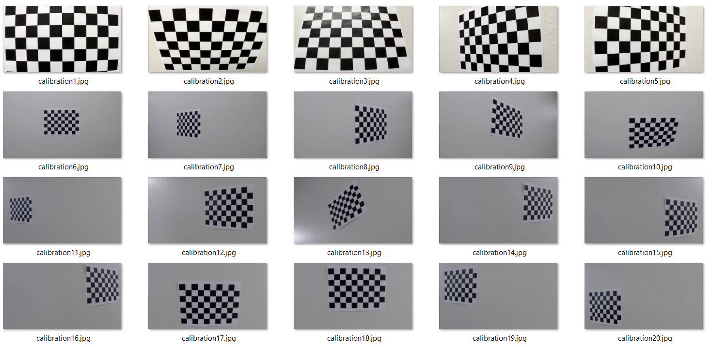


```python
def camera_calibration(images, nx, ny):
    
    #Prepare object points
    objp = np.zeros((ny*nx, 3), np.float32)
    objp[:, :2] = np.mgrid[0:nx, 0:ny].transpose().reshape(-1, 2)
    objpoints = []
    imgpoints = []
    for sample_img in images:   
        #read image
        img = cv2.imread(sample_img)       
        #get image size
        img_size = (img.shape[1], img.shape[0])  
        #convert our image to grayscale
        gray = cv2.cvtColor(img, cv2.COLOR_BGR2GRAY)      
        #find the chessboard corners
        ret, corners = cv2.findChessboardCorners(gray, (nx, ny), None)
        #if corners found
        if ret:
            objpoints.append(objp)
            imgpoints.append(corners)
    #calculate the camera calibration matrix and the distortion coefficient based on our 	 objectpoint and image points
    ret, mtx, dist, _, _ = cv2.calibrateCamera(objpoints, imgpoints, img_size, None, None)   
    return mtx, dist
```


## 2. Image distortion

Using the previous calibration matrix and the distortion coefficients we can now to build an function to undistort image or frame coming from the camera.

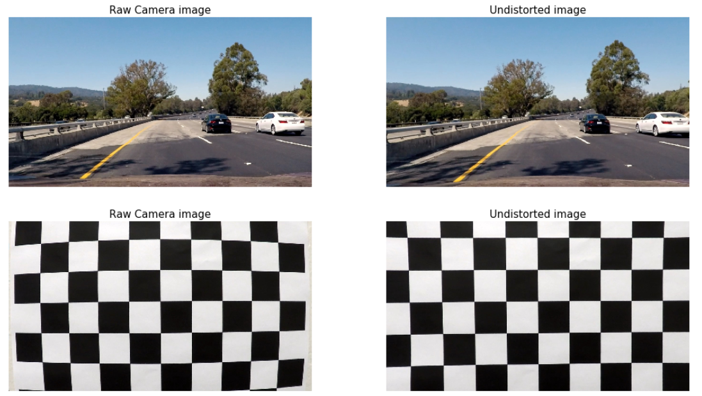


We can know undistort images from the camera and start to work on our pipeline ! Please note that I have displayed a chessboard image so that the undistortion get more visible for our human eyes but it can be seen also on our test image looking at the car hood shape for instance.

## 3. Creating a thresholded binary image

In this part we will apply different threshold either to color channel or to computed image gradient in order to best detect the lanes.

### 3.1 Color space

In this section we will explore different color space and select the one that will be the most useful for us to detect the lane line. Here is the list of the explored color space :

```python
#initial RGB image
rgb = test_img
r_channel = rgb[:,:,0]
g_channel = rgb[:,:,1]
b_channel = rgb[:,:,2]

#HLS colorspace
hls = cv2.cvtColor(test_img, cv2.COLOR_RGB2HLS)
hls_h_channel = hls[:,:,0]
hls_l_channel = hls[:,:,1]
hls_s_channel = hls[:,:,2]

#HSV colorspace
hsv = cv2.cvtColor(test_img, cv2.COLOR_RGB2HSV)
hsv_h_channel = hsv[:,:,0] #h – Hue ( Dominant Wavelength ).
hsv_s_channel = hsv[:,:,1] #s – Saturation ( Purity / shades of the color ).
hsv_v_channel = hsv[:,:,2] #v – Value ( Intensity ).

#LAB colorspace
lab = cv2.cvtColor(test_img, cv2.COLOR_RGB2Lab)
lab_l_channel = lab[:,:,0] #l – Lightness ( Intensity ).
lab_a_channel = lab[:,:,1] #a – color component ranging from Green to Magenta.
lab_b_channel = lab[:,:,2] #b – color component ranging from Blue to Yellow.

#LAB colorspace
yuv = cv2.cvtColor(test_img, cv2.COLOR_RGB2YUV)
yuv_y_channel = yuv[:,:,0] #y
yuv_u_channel = yuv[:,:,1] #u
yuv_v_channel = yuv[:,:,2] #v 

#Luv COLORSPACE[:,:,0] 
luv = cv2.cvtColor(test_img, cv2.COLOR_RGB2LUV)
luv_l_channel = luv[:,:,0] #l
luv_u_channel = luv[:,:,1] #u
luv_v_channel = luv[:,:,2] #v 
```

#### Color space exploration

Here is bellow the result of our different color space isolation:

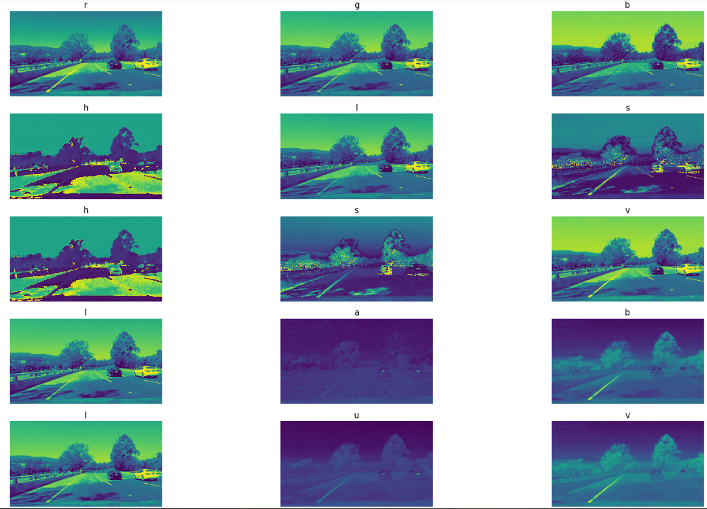

We can see that the hls s channel give pretty consistent result for both blank and white line , without being too much impacted by shadow. the LAB B channel sounds pretty good at detecting yellow lane as well and respectively the l channel for the white lane. Lets see if we can filter the hls_l_channel and the lab_b_channel to further improve our results.

#### Thresholding the LAB B channel 

```python
#convert rgb image to lab , isolate the b channel , thershold it and return a binary image
def img_to_threshold_lab_b(img,setmin=None):   
    if setmin != None:
        min =setmin       
    else:
        #HSV colorspace for adaptive filtering
        hsv = cv2.cvtColor(img, cv2.COLOR_RGB2HSV)
        hsv_v_channel = hsv[:,:,2] #v – Value ( Intensity ).
        #Adaptive thresholding
        min = map_threshold_lab_b(hsv_v_channel.mean())
    max =255
    # convert img to lab
    lab = cv2.cvtColor(img, cv2.COLOR_RGB2Lab)
    #isolate the b channel
    lab_b = lab[:,:,2]
    #create our array that will contained the thresholded l channel
    thresholded_img = np.zeros_like(lab_b)
    #thershold the s channel and return a binary image
    thresholded_img[(lab_b > min) & (lab_b <= max)] = 1
    return thresholded_img
```

#### Output

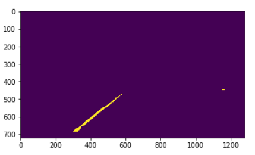

#### Thresholding the HLS L channel 

The HLS L channel have been extracted similarly

```python
#convert rgb image to hls , isolate the l channel , thershold it and return a binary image

def img_to_threshold_hls_l(img,setmin=None):
    
    if setmin != None:
        min =setmin
    else:
        #HSV colorspace for adaptive filtering
        hsv = cv2.cvtColor(img, cv2.COLOR_RGB2HSV)
        hsv_v_channel = hsv[:,:,2] #v – Value ( Intensity ).
        #Adaptive thresholding
        min = map_threshold_hls_l(hsv_v_channel.mean())
    max =255
    # convert img to HLS
    hls = cv2.cvtColor(img, cv2.COLOR_RGB2HLS)
    #isolate the l channel
    hls_l = hls[:,:,1]
    #create our array that will contained the thresholded l channel
    thresholded_img = np.zeros_like(hls_l)
    #threshold the l channel and return a binary image
    thresholded_img[(hls_l > min) & (hls_l <= max)] = 1
    return thresholded_img
```

#### Output

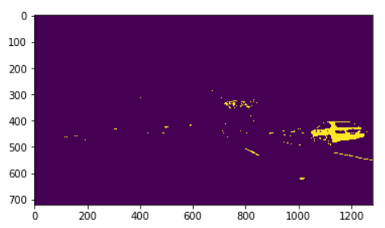

#### Combining the color space

Now that we have been isolating the different color spaces channel , we will now combine them 

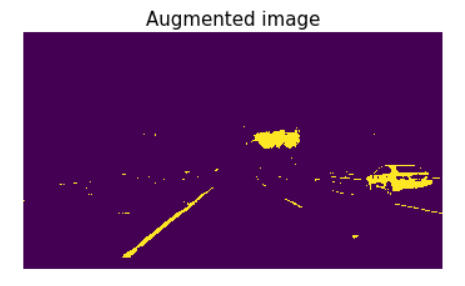

the result look promising as we can easily detect both lines lets continue building our pipeline ! 

As different conditions may cause the thresholds to be good for one frame but terrible for another one , I have implemented a "dynamic threshold" based on manually thresholding different frame on different brightness/contrast and so on. The coefficients I have kept are defined as follow :

```python
def map_threshold_lab_b(value):
    HSV_means = [57, 79, 129, 135, 140, 150]
    LAB_thresholds = [150, 150, 150, 160, 160, 160]
    value = np.interp(value, HSV_means, LAB_thresholds)  
    return value

def map_threshold_hls_l(value):
    HSV_means = [57, 79,100, 135, 140, 150]
    HLS_thresholds = [173, 175,190, 190, 215, 215]
    value = np.interp(value, HSV_means, HLS_thresholds)  
    return value
```

N. B I have been trying many different color space combination theses two are the one I have decided to keep after the many attempts.

### 3.2 Image gradient

in an attempt to increase the lane detection we will explore image magnitude and direction gradient.

#### Image direction gradient

In order for use to compute directional gradient, we will use the sobel operator that is at the heart of the Canny edge detection algorithm, this to compute vertical and horizontal gradients to best detect our line. 

```python
def sobel_xy_threshold(img, xmin=10 , xmax=255, ymin=50 ,ymax=255):

    #Image to gray
    gray = cv2.cvtColor(img,cv2.COLOR_BGR2GRAY)

    # Sobel x and y
    sobelx = cv2.Sobel(gray, cv2.CV_64F, 1, 0) # Take the derivative in x
    sobely = cv2.Sobel(gray, cv2.CV_64F, 0, 1) # Take the derivative in y

    abs_sobelx = np.absolute(sobelx) # Absolute x derivative to accentuate lines away from horizontal
    abs_sobely = np.absolute(sobely) # Absolute y derivative to accentuate lines away from vertical

    scaled_sobelx = np.uint8(255*abs_sobelx/np.max(abs_sobelx))
    scaled_sobely = np.uint8(255*abs_sobely/np.max(abs_sobely))

    sxbinary = np.zeros_like(scaled_sobelx)
    sxbinary[(scaled_sobelx >= xmin) & (scaled_sobelx <= xmax)] = 1 

    sybinary = np.zeros_like(scaled_sobely)
    sybinary[(scaled_sobely >= ymin) & (scaled_sobely <= ymax)] = 1

    combined = np.zeros_like(scaled_sobelx)
    combined[((sxbinary == 1) & (sybinary == 1))] = 1

return combined
```
#### Directional gradient results

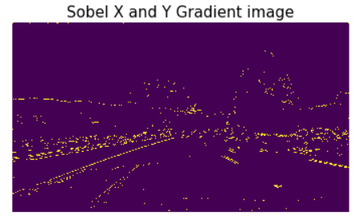

We can see that the magnitude gradient contains lots of noise , that could be reduce probably with a gaussian smoothing but is able to detect lane line as well as the road borders that could confuse our lane search algorithm.  

#### Magnitude gradient 

Similarly we will explore magnitude gradient by calculating the gradient magnitude as :

```python
 # Calculate the gradient magnitude
    sobelm = np.sqrt(sobelx ** 2 + sobely ** 2)
    scaled_sobelm = np.uint8(255*sobelm/np.max(sobelm))
```

#### Magnitude gradient results

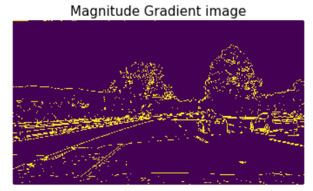

The magnitude gradient doesn't seems to help a lot for our sample image.

We will then continue building our pipeline keeping only the dynamic thresholding on the chosen color space channels.


## 4. Region of interest and Perspective transform

At this stage we have had good results with detecting the lane, lets now define a region of interest and do a perspective transform. The code for my perspective transform includes a function called `bird_eye_view()`, The `bird_eye_view()` function takes as inputs an image (`img`), as well an attribute to select whether the function will return the inverse Matrix.

I chose the hardcode the source and destination points in the following manner:

```python
    #set dest and source point
    src = np.float32([(575,464),(707,464),(258,682),(1049,682)])
    dst = np.float32([(450,0),(img.shape[1]-450,0),(450,img.shape[0]),(img.shape[1]-450,img.shape[0])])

```

here is the full function definition :

```python
def bird_eye_view(img, getMinv=False):
    #set dest and source point
    src = np.float32([(575,464),(707,464),(258,682),(1049,682)])
    dst = np.float32([(450,0),(img.shape[1]-450,0),(450,img.shape[0]),(img.shape[1]-450,img.shape[0])])
    
    #get the perpective transform Matrix
    M = cv2.getPerspectiveTransform(src, dst)
    
    #get theinverse transform Matrix
    Minv = cv2.getPerspectiveTransform(dst, src)
    
    # use warp the image
    warped = cv2.warpPerspective(img, M, (img.shape[1],img.shape[0]), flags=cv2.INTER_LINEAR)
    
    if getMinv==False:
        return warped
    else:
        return warped, Minv
```

This function enable us to focus only on areas where we are likely to detect the lane as well as transforming the perspective to a bird eye view perspective so we can then modelise our lanes and calculate curvatures.

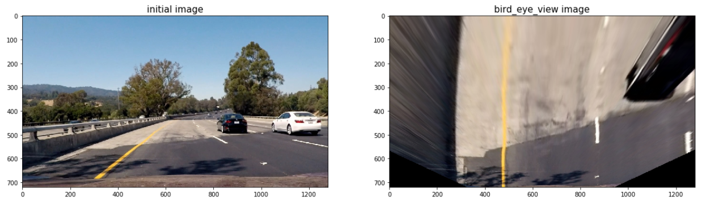

We can know apply our bird eye view perspective transform to an image that we have been extracting the color space channels , the result is as follow :

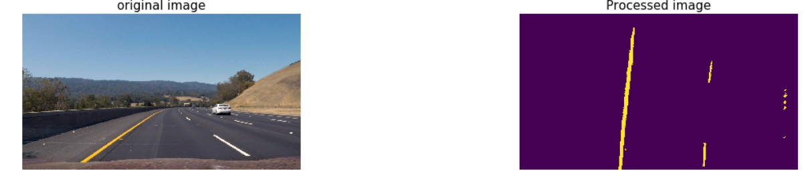


## 5. Detect lane pixels and fit to find the lane boundary

At this stage , we still need to decide explicitly which pixels are part of the lines and which belong to the left line and which belong to the right line.

```python
test_img = glob.glob('./test_images/*.jpg')
fig = plt.figure(figsize=(15, 60))
i=1

for img_path in test_img:
    
    img = plt.imread(img_path)
    augmented_img = bird_eye_view(augmented_colorspace(img))
    
    plt.subplot(16,2,i)
    plt.imshow(augmented_img)
    plt.title('Bird eye view image',fontsize=15)
    i=i+1
    
    plt.subplot(16,2,i)
    histogram = np.sum(augmented_img[augmented_img.shape[0]//2:,:], axis=0)
    plt.plot(histogram)
    plt.title('Historgram',fontsize=15)
    i=i+1
```

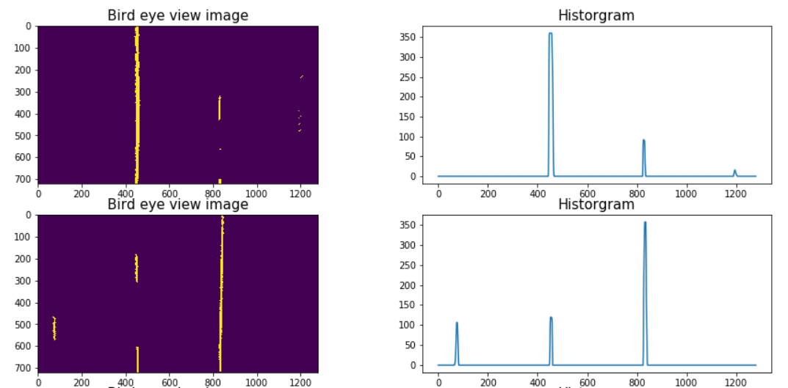


With this histogram we will be adding up the pixel values along each column in the image. as in our thresholded binary image, pixels are either 0 or 1, the two most prominent peaks in this histogram will be good indicators of the x-position of the base of the lane lines. we can use that as a starting point for where to search for the lines. 

### Sliding windows polynomial fit

From that point, we can use a sliding window, placed around the line centers, to find and follow the lines up to the top of the frame.  This is achieved by my `first_polynomfit_with_sliding_windows()` function that can be found in my code.

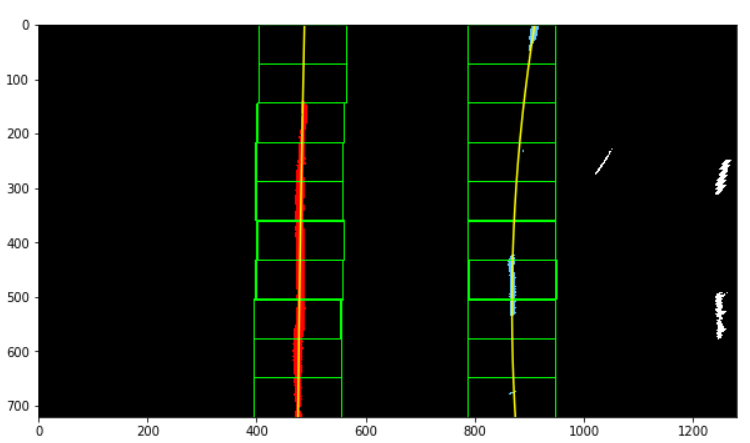

We have now managed to fit a second order polynomial equation to our lane, using 10 windows for our windows search with a margin of 80 px and a minimum pixel detection set at 40 px.

Since the windows search is quite computing expensive and as the lane lines position in the next image of a videoframe is likely to have +- the same position we won't run this detection algorithm each time but instead just search in a margin around the previous line position a starting point for the next frame if we have successfully detected the lane line in the past frame as seen bellow. 

This is achieved by my `next_polynomfit_with_sliding_windows()` function that can be found in my code.

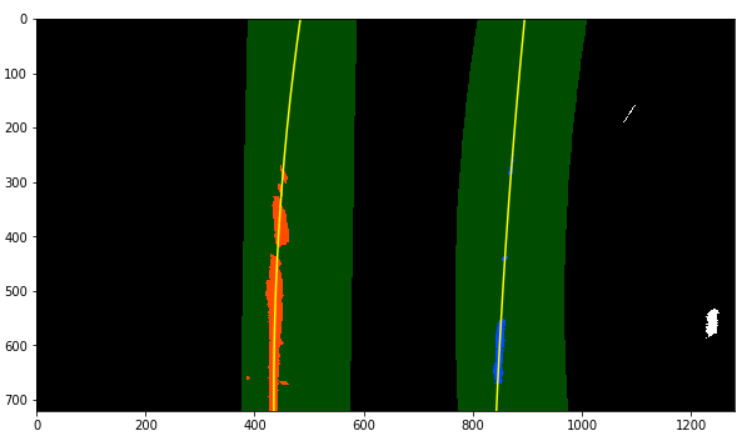


## 6. Determine the curvature of the lane and vehicle position with respect to center

Now that we were able to modelize our lanes with a polynomial equation , we will now implement a function that will help us calculating the curvature of the lane and the position with respect to the center of our vehicle. The output of the function (that can be found in the jupyter notebook) is as bellow.

This is achieved by my `get_curve_and_center()` function that can be found in my code.

```python
Curvature : 237.3613353268783 center_dist_m : -0.15763083894999735
```


## 7. Warp the detected lane boundaries back onto the original image.

Now that we were able to detect lanes , modelise both of them with a 2nd order polynom and calculate the radius and the relative car center position, it is time to display these information back on to the original image as per the image extracted from my pipeline bellow. 

This is achieved by my `draw_lanes()` function that can be found in my code.

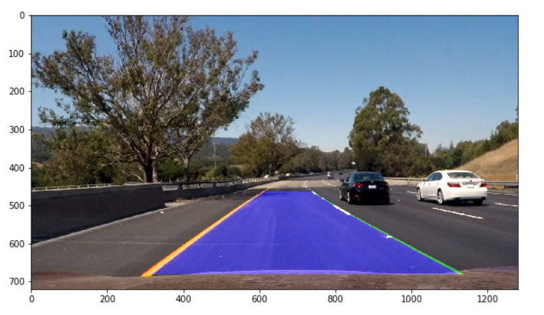


## 8. Output visual display for the numerical estimation of lane curvature and vehicle position.

At this stage i have been using OpenCV to add my curvature value as well as my calculated car position relative to the center of the road.

```python
    # Add Radius 
    cv2.putText(img, text2, org1, font, fontScale, color, thickness, lineType)

    # Add Center position 
    cv2.putText(img, text3, org2, font, fontScale, color, thickness, lineType)
```

This is achieved by my `draw_data()` function that can be found in my code. Here is the result extracted from my pipeline :

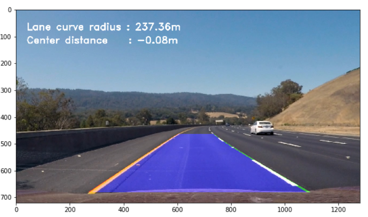


## 9. Final Pipeline

It is time to build our final pipeline ! After few trials and attempt on our pipeline , I've decided to create a lane class, this to help choosing to run a full window search if the lane is not detected or skip it if the lane as been detected. The lane class will also help filtering bad fit for optimizing our pipeline output result by returning the last average lane fit when the detection is very far from the past one.

Here is my lane class implementation :

```python
#define a Lane class
class lane:
    def __init__(self):
        self.leftisdetected = False
        self.rightisdetected = False
        self.left_fit = []
        self.right_fit = []
        self.average_left_fit = []
        self.average_right_fit = []
        self.left_good_fit = []
        self.right_good_fit = []   
        
    def __del__(self):
        print("lane deleted")
        
    def log_left_fit(self, left_fit):
        a = left_fit[0]
        b = left_fit[1]
        c = left_fit[2]
        self.left_fit.append([a,b,c])
        print("left_fit logged as :",self.left_fit[-1])
    
    def log_right_fit(self, right_fit):
        a = right_fit[0]
        b = right_fit[1]
        c = right_fit[2] 
        self.right_fit.append([a,b,c])
        print("right_fit logged as :",self.right_fit[-1])
        
    def last_left_fit(self):
        #Average on the last n frame
        nframe=5
        a=0
        b=0
        c=0
        #average the last 5 detections
        if len(self.left_fit)>nframe+1:
            for i in range(nframe):
                #sum lane coefficient
                a = a+ self.left_fit[-(i+1)][0]
                b = b+ self.left_fit[-(i+1)][1]
                c = c+ self.left_fit[-(i+1)][2]
                
            self.average_left_fit = [a/nframe , b/nframe , c/nframe]
            print("average left fit :",self.average_left_fit)
    
        #if we have a good fit in the past compare it
        if len(self.left_good_fit)>0 and len(self.average_left_fit)>0:
             
            #if the new detected lane coef are further than a specific range from our last good match, it is a bad fit, else it sounds like a good fit 
            if (abs(self.left_fit[-1][0]-self.left_good_fit[-1][0])>0.001 and
            abs(self.left_fit[-1][1]-self.left_good_fit[-1][1])>1.0 and
            abs(self.left_fit[-1][2]-self.left_good_fit[-1][2])>100.):
                
                #if we have no goodfit lets use the average for the last 5 frames
                self.leftisdetected = False
                self.left_good_fit.append(self.average_left_fit)
                print("left fit output (Average):",self.average_left_fit)
                return self.average_left_fit
            else:
                #if this is a good fit
                self.leftisdetected = True
                self.left_good_fit.append(self.left_fit[-1])
                print("left fit output (New Good Fit):",self.left_fit[-1])
                return self.left_good_fit[-1]
       
        #if no average return last detection
        else:
            print("left fit output (Last detection):",self.left_fit[-1])
            self.left_good_fit.append(self.left_fit[-1])
            self.leftisdetected = False
            return self.left_fit[-1]        
    
    def last_right_fit(self):
        #Average on the last n frame
        nframe=5
        a=0
        b=0
        c=0
        #average the last 5 detections
        if len(self.right_fit)>nframe+1:
            for i in range(nframe):
                #sum lane coefficient
                a = a+ self.right_fit[-(i+1)][0]
                b = b+ self.right_fit[-(i+1)][1]
                c = c+ self.right_fit[-(i+1)][2]
                
            self.average_right_fit = [a/nframe , b/nframe , c/nframe]
            print("average right fit :",self.average_right_fit)
    
        #if we have a good fit in the past compare it
        if len(self.right_good_fit)>0 and len(self.average_right_fit)>0:
             
            #if the new detected lane coef are further than a specific range from our last good match, it is a bad fit, else it sounds like a good fit 
            if(abs(self.right_fit[-1][0]-self.right_good_fit[-1][0])>0.001 and
            abs(self.right_fit[-1][1]-self.right_good_fit[-1][1])>1.0 and
            abs(self.right_fit[-1][2]-self.right_good_fit[-1][2])>100.):
                
                #if we have no goodfit lets use the average for the last 5 frames
                print("right fit output (Average):",self.average_right_fit)
                self.rightisdetected = False
                self.right_good_fit.append(self.average_right_fit)
                return self.average_right_fit
            else:
                #if this is a good fit
                self.rightisdetected = True
                self.right_good_fit.append(self.right_fit[-1])
                print("right fit output (New Good Fit):",self.right_fit[-1])
                return self.right_good_fit[-1]

        #if no average return last detection
        else:
            print("right fit output (Last detection):",self.right_fit[-1])
            self.rightisdetected = False
            self.right_good_fit.append(self.right_fit[-1])
            return self.right_fit[-1]   
    
    def leftisdetected(self):
        return self.leftisdetected
    
    def rightisdetected(self):
        return self.rightisdetected
```


We can now define our full pipeline as follow :

```python
lane = lane()   

def Process_video_frame(img):
    
    #undistort the image
    undistorted_img = undistort(img)
    
    #get image augmented colorspace
    aug_img = augmented_colorspace(undistorted_img)
    
    #Transform perspective to bird eye view
    top_aug_img, Minv = bird_eye_view(aug_img, getMinv=True)
    
    if lane.leftisdetected == False or lane.rightisdetected == False:
        
        print("windows search...")
        
        #windows lane search
        left_fit, right_fit, left_lane_inds, right_lane_inds, rectangles = first_polynomfit_with_sliding_windows(top_aug_img)
        
        if left_fit is not None:
            lane.log_left_fit(left_fit)
        if right_fit is not None:
            lane.log_right_fit(right_fit)
   
    else:
        #if lane already detected
        print("Next search...")   
        
        left_fit =lane.last_left_fit()
        right_fit = lane.last_right_fit()
        
       
        left_fit, right_fit, left_lane_inds, right_lane_inds, margin = next_polynomfit_with_sliding_windows(top_aug_img,left_fit,right_fit)     
       
        if left_fit is not None:
            lane.log_left_fit(left_fit)
        if right_fit is not None:
            lane.log_right_fit(right_fit) 
       
    #get the filtered lane fit
    left_fit = lane.last_left_fit()
    right_fit = lane.last_right_fit()
    
    print("lane.last_left_fit :",left_fit)
    print("lane.last_right_fit :",right_fit)
        
    #get lane curvature and center distance
    curvature,_, _, center_dist_m = get_curve_and_center(top_aug_img ,left_fit, right_fit, left_lane_inds, right_lane_inds)
    
    #drane lane
    img_with_lane = draw_lanes(img, top_aug_img, left_fit, right_fit, Minv)
    
    #draw data
    img_with_data = draw_data(img_with_lane,curvature,center_dist_m)
    
    return img_with_data
```
---

### Conclusion 

This overall approach work  pretty well on a known environment where we can predefine thresholds and parameters that will fit with it however Introduction of few changes  with regards to the brightness, lane color , lane curve , road type and other could impact our model performance. 

Designing adaptive thresholding methods as we did from a very high level could help getting optimal parameters  and result for these new positions and I also think that we could probably improve detecting more curvy lane (mountain roads) with higher degree polynomial fit.

The window search is quite expensive especially when it needs to be run several time in poor detection situation and further work could also be to adapt the algorithm and the pipeline for a real time application on an embedded HW. Finally adapting gradient thresholding to the intersection/road type could also help for crucial detection such as intersection lane vs highway lane. 

I think that mapping system could be a good help , helping double checking what we see vs what is expected (lane curvature) it can also be a help classifying intersection and road type for a dynamically adapt the thresholds/parameters. It would be interesting to use Deep Learning as oppose to computer vision to further improve detection surrounding the car environment.

Here's a [link to my video result](https://youtu.be/aNl6vEPrNvk)

---


