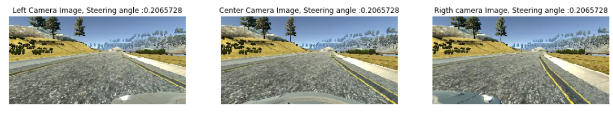

# **Behavioral Cloning** Project 


In this project we will use deep neural networks and convolutional neural networks to clone driving behavior. With the help of a driving simulator, we will train, validate and test a model using Keras. The model will output a steering angle to an autonomous vehicle that will drive on a simulator track.The CNN thus clones the human driving behavior.  

Can't wait ? Check out the YouTube video [here](https://www.youtube.com/watch?v=i4ejbgO7Bec) ! 

The goals / steps of this project are the following:

1. Use the simulator to collect data of good driving behavior
2. Build, a convolution neural network in Keras that predicts steering angles from images
3. Train and validate the model with a training and validation set
4. Test that the model successfully drives around track one without leaving the road
5. Summarize the results

## Project file structure

Here are the element that constitute the code for this project :

* `Behavioral_Cloning.ipynb`  - Our main Jupyter notebook code

- `model.py` - The script used to create and train the model.

- `drive.py` - The script to drive the car. (modified to reflect our image preprocessing)

- `model.h5` - The saved model. 

- `video.mp4` - A video recording of your vehicle driving autonomously at least one lap around the track.


## Simulator Data Collection

The simulator recorded 9-10 data points per second. 

Each data point comprised 7 attributes:

### Images

1. Image taken from the center camera on the car

2. Image taken from the left camera on the car

3. Image taken from the right camera on the car

   

   

### CSV file

1. Steering angle (float number between from -1.0 to 1.0)
2. Throttle
3. Break
4. Speed

Here are and extract of few sample data:

|      | Center Image                           | Left Image                           | Right Image                           | Steering Angle | Throttle | Break | Speed     |
| ---- | -------------------------------------- | ------------------------------------ | ------------------------------------- | -------------- | -------- | ----- | --------- |
| 0    | IMG/center_2016_12_01_13_30_48_287.jpg | IMG/left_2016_12_01_13_30_48_287.jpg | IMG/right_2016_12_01_13_30_48_287.jpg | 0.0            | 0.0      | 0.0   | 22.148290 |
| 1    | IMG/center_2016_12_01_13_30_48_404.jpg | IMG/left_2016_12_01_13_30_48_404.jpg | IMG/right_2016_12_01_13_30_48_404.jpg | 0.0            | 0.0      | 0.0   | 21.879630 |


### Data analysis/exploration

In order to get data and to achieve a good modeling , we have been recording 2-3 laps on the tracks and did the same driving on the opposite way. After trial an error we've also added few recovery scenario to teach the car how to get back to the center of the road and we've ended up with a dataset of shape (23924, 7) where each line contains our 7 Data Points. Each camera image is of shape: (160, 320, 3). this ended up in the following Steering angle spreading :


We can see that the steering angle distribution cover all kind of range between [-1.0 and 1.0] however we can notice a strong concentration of data surrounding the neutral steering position (up to 10,000! samples). This will cause our model to mostly learn how to drive straightforward,for this reason we will rebalance our data. Hopefully the additional recovering scenario data will also help recover from odd position. 

#### Rebalancing the data

We have been been keeping only few samples where the steering angle was equal to zero and have been also removing some samples for which we had enough angle values. 


The data sounds now more balanced , hopefully this help our model turning when needed and not only teaches him going only straightforward.


# Data Preprocessing

Before training our model we will preprocess the images as per the following (image preprocessing will be called within our generator and will occur on the fly as the model get trained) :

### Image cropping , resizing and blurring

As our model can be confused by the low part where we see the car hood , we will crop this part. In addition to this the top part of the image contains only landscape and sky , which doesn't represent a great deal of useful information for our model. We will then have our model focusing on the road by cropping 65px from top and 25px from the bottom of our original image of size (160,320, 3). After cropping the image we will also resize the image to a (90,60,3) size for memory consideration. 


## Data Augmentation

#### Initial state:

In order to improve our model performance we have acquired data driving :

1. several laps in the right way
2. several slaps in the opposite track way.
3. We have also recorded few recovering scenarios where we put the car in bad situation on purpose and record how to recover from it. This is where we get extremum steering angle data.

#### Lets get even more data :

1. For us to get even more driving data and not having to spend a lot of time driving the car on the simulator, we will not only use the center camera but as well as the right and left camera, this should triple our Training set ( for this part we will slightly modify angle value for the left and right camera

   

2. In addition to this, we will apply a vertical mirror filter on the images and chnage the steering angle. This should also double our available dataset.

   

3. Lets also apply random contrast/brightness and image scaling

   


## Lets Define our model 

For this project we will chose an architecture developed by Nvidia that we will slightly adapt to our project needs and for optimal performance. The model details can be found in this [paper](https://images.nvidia.com/content/tegra/automotive/images/2016/solutions/pdf/end-to-end-dl-using-px.pdf) and is as follow :


Build on top of it here is our implementation for the model : 

The data is first being normalized using a Keras lambda layer, our input shape is also set to (60, 90, 3) to match with our model images input

```python
nvidia.add(Lambda(lambda x: x/255. - 0.5, input_shape=(60, 90, 3)))
```

We then add convolutional layers with 3x3 filter and activation RELU layers to introduce nonlinearity. 

```python
nvidia.add(Conv2D(24, (3, 3), activation="relu", strides=(2, 2)))
nvidia.add(Conv2D(36, (3, 3), activation="relu", strides=(2, 2)))
nvidia.add(Conv2D(48, (3, 3), activation="relu"))
nvidia.add(Conv2D(64, (3, 3), activation="relu"))
nvidia.add(Conv2D(64, (3, 3), activation="relu"))
```

To prevent overfitting, we add a dropout layer with 50% keep probability

```python
nvidia.add(Dropout(0.5))
```

we then add our fully connected layers to slowly end up in 1 single output (our steering angle prediction)

```python
nvidia.add(Flatten())
nvidia.add(Dense(100))
nvidia.add(Dense(50))
nvidia.add(Dense(10))
nvidia.add(Dense(1))
```


## Model performance 

Even though we have been resizing the images , the model will still have to deal with a lot of images that needs to be preprocessed, preprocessing our samples and loading them in memory would mostly cause memory error on standards workstation. In order to run the model with reasonable GPU/RAM setting we will use generator so we can preprocess the images on the fly with our CPU while training our model on GPU.

N. B. We will use YUV image space for training our model (recommended for the Nvidia model)

Our Generator function is as follow :

```python
BATCH_SIZE = 64
def generator(df, batch_size=BATCH_SIZE):
    
    num_samples = len(df)
   
    #infinite looping
    while True:
        
        for offset in range(0, num_samples, batch_size):
            
            images = []
            angles = []
                      
            batch_samples = df[offset:offset+batch_size]
            center_img_path = batch_samples[['Center Image']]
            left_img_path = batch_samples[['Left Image']]
            right_img_path = batch_samples[['Right Image']]    
            
            for i in range(len(batch_samples)):
                                
                '''Center image '''
                #set angle correction
                correction = 0
                
                #get angle
                angle = float(df.iloc[i][3])

                #get path
                center_path = center_img_path.iloc[i][0].replace('\\','/')
                center_img = process_image(center_path)

                #load the camera image in our dataset
                images.append(center_img)
                angles.append(angle)
                    
                # generate a flipped image and load it in our dataset
                images.append(flip_img(center_img))
                angles.append(-(angle + correction))

                #Generate augmented image and load it in our dataset
                images.append(random_contrast(center_img))
                angles.append(angle + correction)

                '''Left image '''
                correction = 0.2

                #get path
                left_path = left_img_path.iloc[i][0].replace('\\','/')
                left_img =  process_image(left_path)

                #load the camera image in our dataset
                images.append(left_img)
                angles.append(angle + correction)

                # generate a flipped image and load it in our dataset
                images.append(flip_img(left_img))
                angles.append(-(angle + correction))

                '''Righ image '''

                #set angle correction
                correction = -0.2

                #get path
                right_path = right_img_path.iloc[i][0].replace('\\','/')
                right_img =  process_image(right_path)

                #load the camera image in our dataseta
                images.append(right_img)
                angles.append(angle + correction)

                # generate a flipped image and load it in our dataset
                images.append(flip_img(right_img))
                angles.append(-(angle + correction))
                images, angles = shuffle(images, angles)
                    
                right_img = None
                left_img = None
                center_img = None
                
            #Output images and angles at the end of each batch    
            yield np.array(images), np.array(angles)
            
            images = None
            angles = None
```

That's it time to train our model !

# Training the model

So we can validate our model we've been splitting our data 80% for the training set and 20% for validation

```python
from sklearn.model_selection import train_test_split

#split our dataset into a train dataset and a validation dataset
train_samples, validation_samples = train_test_split(df, test_size=0.2)

# Create our generator function
train_generator = generator(train_samples, BATCH_SIZE)
validation_generator = generator(validation_samples, BATCH_SIZE)
```

Our model will use our generator and Adam optimizer, although the learning rate is not needed we've set it manually to 1e-4 for better results.

After 2 epochs our model achieved : loss: 0.0402 - val_loss: 0.0389 Wall time: 1min 47s


So far the model seems to perform well on the validation set but it doesn't mean that the car will perform well on the track , the solution : lets try it on the simulator ! 

# Simulator Testing

Before we are able to try the model lets make sure the simulator will preprocess the image the same way as we did for training our model by modifying drive.py 

the following function have been added  to the file :

```python
def gaussian_blur(img, kernel_size):
    """Applies a Gaussian Noise kernel"""
    return cv2.GaussianBlur(img, (kernel_size, kernel_size), 0)`

def crop_and_resize(img):
    y, x, z = img.shape
    crop_img = img[65:y-25, 0:x]
    resized_img = cv2.resize(crop_img, (90,60))
    return resized_img

def process_image(img):
    crop_b_img = crop_and_resize(gaussian_blur(img,3))
    img = cv2.cvtColor(crop_b_img, cv2.COLOR_RGB2YUV)
    return img
```

Our model is now ready to go check out the **[video](https://www.youtube.com/watch?v=i4ejbgO7Bec)**! 

# Conclusion

After days of trials I can say that 80% of success is due to data's, trying different model or training it for a huge number of epochs is not making a great deal for this application. I've mostly improve the model performance collecting more data especially on the part of track where the car did not drive so well (e.g. strong turns or road part without lane lines and dirt on the side).

Rebalancing our data also helped a lot the model to go less straightforward and make better turns.

It was amazing to see how we can train the car to make decision based of very few training samples, this is very powerful although a big impediment for behavior cloning is that the model won't know how to react to a situation he has never seen or has not been trained enough for.

Further work :

The model behavior still feel robotic and I feel this could be improved by smoothing the model output. The rebalancing function could also be improved.

The model have been trained for this track and would required much more different samples so it can generalize well and pass successfully other simulator track

