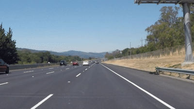
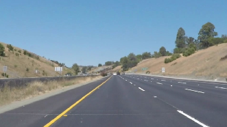
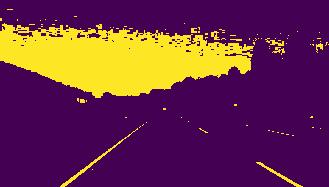
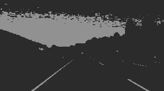
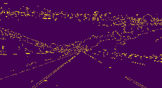
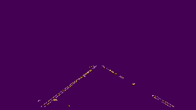
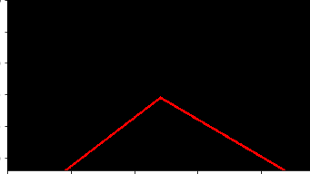
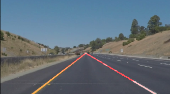

# **Finding Lane Lines on the Road** 

Overview
---

When we drive, we use our eyes to decide where to go.  The lines on the road that show us where the lanes are act as our constant reference for where to steer the vehicle.  Naturally, one of the first things we would like to do in developing a self-driving car is to automatically detect lane lines using an algorithm.

In this project we will detect lane lines in images using Python and OpenCV.  OpenCV means "Open-Source Computer Vision", which is a package that has many useful tools for analyzing images.  

Personal reflection
---

It was fantastic to see how easy quick OpenCV functions could help achieve this project. This project was a good opportunity to see some challenges this basic approach face for example:

whenever the image gets brighter, when the colors are more difficult to distinguish or when the road ahead is more curved and so on.

This is a good opportunity to see that manual parameter tuning is time consuming and automating the parameter finding/dynamic parameters could be really helpful especially as specific parameters fit well specific conditions but can really be un-adapted for others.

How I have solved the problematic:
---

### Pipeline Description

To find the lane lines using this basic computer vision approach, I have been building a pipeline that consist of: 

a)	Getting the input image

 

b)	Applying a filter on the yellow and white color for easier lane detection
 
 

c)	Grayscale the filtered image
 
 

d)	Smooth the image applying a 5px kernel Gaussian blur
 
 
 
e)	Apply canny edge to our grayscale image
 
 
 
f)	Define a region of interest and filter the image
 
 

g)	Apply Hough transform
 
 

h)	Finally weight the original image with the results.
 
  

Note that I made a slightly different pipeline for the challenge video as I’ve notice applying canny edge directly on the filtered colored image improve the end result. 
In order to draw a single line on the left and right lanes, I modified the draw_lines() function apply inside the Hough transform function to find the lines with the maximum and slopes, and averages all lines. I also apply a tolerance 

### Possible improvements 
Smoothing the shaky motion of the lines in the video (maybe we could consider the past line state and allow only a maximum change of it)

My current pipeline doesn’t support curve the way I have implemented it, it would be a nice additional feature for improving it, very sloppy/curvy road would be a real challenge for this current implementation.

This current pipeline would not perform well if the lines would have other colors and it would also certainly fail in dark or super bright environment due to contrast problem as approach a little in the challenge video.
