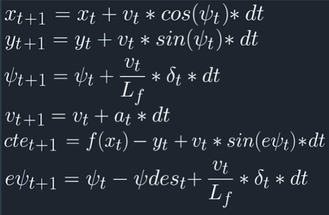
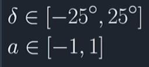

# CarND-Controls-MPC
In this project we will implement a Model Predictive Control to drive a car around a track in a simulator provided by Udacity. Information exchanged between the simulator and our program is made possible  through websocket allowing data such as car telemetry ,the track waypoint to be exchanged as well as sending commands to the vehicle (throttle,steering).

​                                             [](https://www.youtube.com/watch?v=PkiE97CUxWY&t=2s)

Since we want the model to be close to a real environment condition the model will have to perform well considering 100ms latency between actuations commands on top of the connection latency. I order for the model to perform successfully, we have been using IPOPT and CPPAD libraries to calculate the optimal actuation command for our vehicle to achieve an optimal trajectory on the track.

---

### Model used for this project

In this project we have been using a kinematic model for our vehicle taking into account :

* x,y : Our vehicle location
* psi : Our vehicle orientation
* v : Our vehicle velocity
* cte : Our Vehicle cross track error
* epsi : the error on psi, the orientation error
* a : our vehicle acceleration
* delta : our vehicle steering angle

Using the state of the vehicle and actuation commands from the previous timestep we can use our model to calculate the step for the current time step following the equation as bellow :





With our actuation commands that follow the constraints as bellow :




Our Job is then to minimize the error between where the vehicle should go , should be and where the model predicted by defining a cost function to tune the controller.

### Model Timestep length and elapsed Duration Time

In our model we've been using :

* N as our timestep length
* dt as our elapsed duration time

In order for our model to achieve successfully driving the car on the track , we have ended up setting them to the following values :

```c++
//after several try here is the  timestep lengh we've ended up with
size_t N = 10;
//here is the timestep we've been chosing as well
double dt = 0.1;
```

 N and dt defines the prediction horizon for our vehicle, with a too important timestep the controller performance is affected negatively as too many data point are to be considered and the controller perform slower as the model gets more and more computational expensive. 

smaller value for dt are not recommended as well , causing the car to crash, dt must be in sync with our system latency which is 100ms.

N =10 an Dt =0.1 are the value we have been ended up with that produce the best outcome on the track. 

### Polynomial Fitting and MPC Preprocessing 

Before fitting a polynomial to the simulator waypoints we preprocess it so we transform them to the vehicle perspective (x=0,y=0 reference ). We also rotate them to follow the car orientation.

This enable to simplify our polynomial fitting since the orientation angle = 0 and our vehicle coordinates is now (0,0). 

```c++
//convert waypoints into car coordinates
for (int i = 0; i < ptsx.size(); i++) {
	double dx = ptsx[i] - px;
	double dy = ptsy[i] - py;
	waypoints_x.push_back(dx * cos(-psi) - dy * sin(-psi));
	waypoints_y.push_back(dx * sin(-psi) + dy * cos(-psi));
	}

double* ptrx = &waypoints_x[0];
double* ptry = &waypoints_y[0];
Eigen::Map<Eigen::VectorXd> waypoints_x_eig(ptrx, 6);
Eigen::Map<Eigen::VectorXd> waypoints_y_eig(ptry, 6);

//fit a polynomial
auto coeffs = polyfit(waypoints_x_eig, waypoints_y_eig, 3);
double cte = polyeval(coeffs, 0);
double epsi = -atan(coeffs[1]);
```

After this we can easily fit a polynomial using the helper function polyfit like in our main.cpp at line 125 as above.

### Model Predictive Control with Latency 

In this project on of the thing we had to deal with was the latency, indeed with a delay of 100ms which was our timestep interval, the actuation were in fact applied 2 timestep after. In order for us to handle this the equations to predict the next step were modified.

 We have also been modifying some cost function to penalize change in Velocity and our vehicle steering angle.

The result of this model  apply to our car in the simulator track can been seen in [this video](https://youtu.be/PkiE97CUxWY)  

## Dependencies

* cmake >= 3.5
 * All OSes: [click here for installation instructions](https://cmake.org/install/)
* make >= 4.1(mac, linux), 3.81(Windows)
  * Linux: make is installed by default on most Linux distros
  * Mac: [install Xcode command line tools to get make](https://developer.apple.com/xcode/features/)
  * Windows: [Click here for installation instructions](http://gnuwin32.sourceforge.net/packages/make.htm)
* gcc/g++ >= 5.4
  * Linux: gcc / g++ is installed by default on most Linux distros
  * Mac: same deal as make - [install Xcode command line tools]((https://developer.apple.com/xcode/features/)
  * Windows: recommend using [MinGW](http://www.mingw.org/)
* [uWebSockets](https://github.com/uWebSockets/uWebSockets)
  * Run either `install-mac.sh` or `install-ubuntu.sh`.
  * If you install from source, checkout to commit `e94b6e1`, i.e.
    ```
    git clone https://github.com/uWebSockets/uWebSockets
    cd uWebSockets
    git checkout e94b6e1
    ```
    Some function signatures have changed in v0.14.x. See [this PR](https://github.com/udacity/CarND-MPC-Project/pull/3) for more details.

* **Ipopt and CppAD:** Please refer to [this document](https://github.com/udacity/CarND-MPC-Project/blob/master/install_Ipopt_CppAD.md) for installation instructions.
* [Eigen](http://eigen.tuxfamily.org/index.php?title=Main_Page). This is already part of the repo so you shouldn't have to worry about it.
* Simulator. You can download these from the [releases tab](https://github.com/udacity/self-driving-car-sim/releases).
* Not a dependency but read the [DATA.md](./DATA.md) for a description of the data sent back from the simulator.


## Basic Build Instructions

1. Clone this repo.
2. Make a build directory: `mkdir build && cd build`
3. Compile: `cmake .. && make`
4. Run it: `./mpc`.
5. 

## Tips

1. It's recommended to test the MPC on basic examples to see if your implementation behaves as desired. One possible example
is the vehicle starting offset of a straight line (reference). If the MPC implementation is correct, after some number of timesteps
(not too many) it should find and track the reference line.
2. The `lake_track_waypoints.csv` file has the waypoints of the lake track. You could use this to fit polynomials and points and see of how well your model tracks curve. NOTE: This file might be not completely in sync with the simulator so your solution should NOT depend on it.
3. For visualization this C++ [matplotlib wrapper](https://github.com/lava/matplotlib-cpp) could be helpful.)
4.  Tips for setting up your environment are available [here](https://classroom.udacity.com/nanodegrees/nd013/parts/40f38239-66b6-46ec-ae68-03afd8a601c8/modules/0949fca6-b379-42af-a919-ee50aa304e6a/lessons/f758c44c-5e40-4e01-93b5-1a82aa4e044f/concepts/23d376c7-0195-4276-bdf0-e02f1f3c665d)
5. **VM Latency:** Some students have reported differences in behavior using VM's ostensibly a result of latency.  Please let us know if issues arise as a result of a VM environment.


