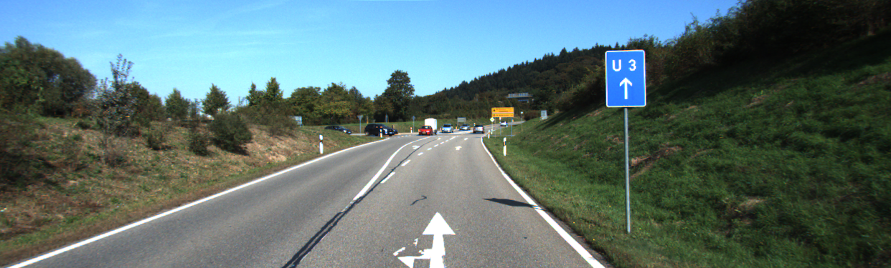
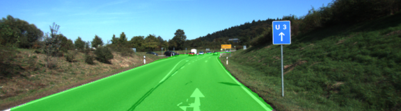
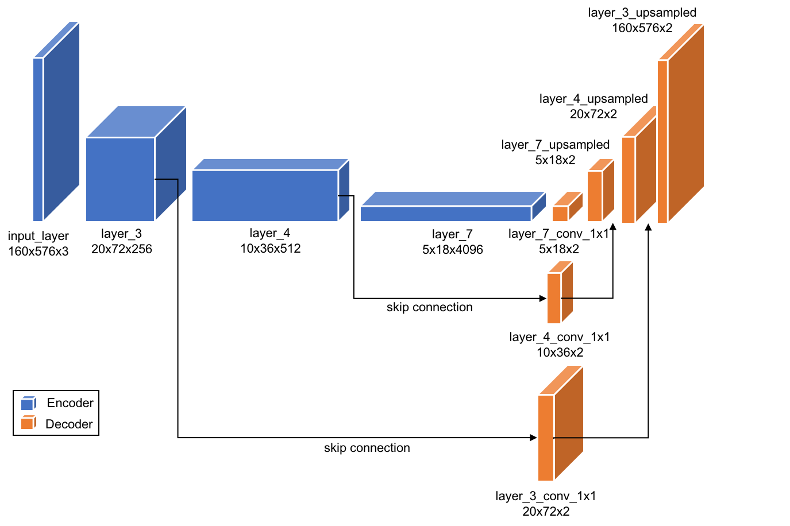
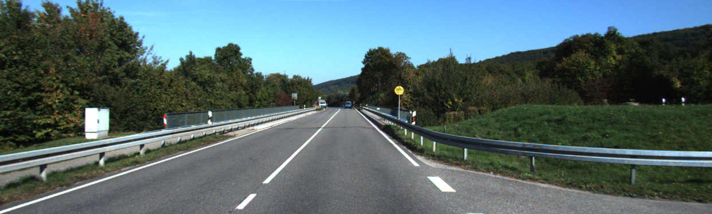
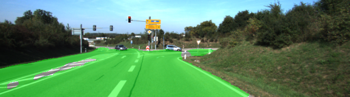
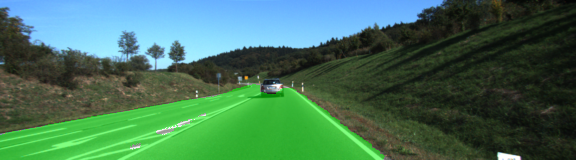
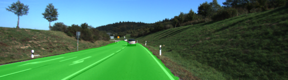
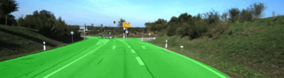

# Semantic Segmentation







### Introduction

In this project our goal is to achieve semantic segmentation and identify road/drivable surfaces on a set of pictures/video. For this matter, we will build a Fully Convolutional Network (FCN) using a pretrained VGG model as a starting point. The architecture of the model is 

**Model Architecture**

In this project we will be using a pretrained fully connected VGG network and turned it into a fully convolutional neural network to achieve our objectives. Our fully convolutional Neural Network will be composed of a Encoder and a Decoder linked by some skip connections. Our Encoder is our loaded VGG Model where fully connected layer as been replace by a 1x1 conv layer to preserve spatial information.We will then use transpose convolution or deconvolution to upsample and build our decoder as described in the  architecture bellow.




**Training the model**


In order to train our model we've been using the [Kitti Road dataset](http://www.cvlibs.net/datasets/kitti/eval_road.php) that contained raw images and labeled images as bellow : 


​										Raw image example



​									Ground truth/labeled example


The hyperparameters used for training our model was the following :

- learning_rate: 0.001
- keep_prob: 0.5
- epochs: 20
- batch_size: 5
- optimizer Adam
- loss function : cross entropy

**Results**

After 20 epochs the our loss was averaging ~ 0.05 ,  which is not to bad given we've spent only 5 min to retrained our model. Training on more epochs , More training data and using some Data augmentation technique could be further work to be added to this project to enhance the precision. We could also envisage using more classes so as to detect not only road but pedestrians, car, traffic signals and on ! 

Bellow are samples of our model output:










### Setup

##### GPU
`main.py` will check to make sure you are using GPU - if you don't have a GPU on your system, you can use AWS or another cloud computing platform.
##### Frameworks and Packages
Make sure you have the following is installed:
 - [Python 3](https://www.python.org/)
 - [TensorFlow](https://www.tensorflow.org/)
 - [NumPy](http://www.numpy.org/)
 - [SciPy](https://www.scipy.org/)
##### Dataset
Download the [Kitti Road dataset](http://www.cvlibs.net/datasets/kitti/eval_road.php) from [here](http://www.cvlibs.net/download.php?file=data_road.zip).  Extract the dataset in the `data` folder.  This will create the folder `data_road` with all the training a test images.

### Start
##### Implement
Implement the code in the `main.py` module indicated by the "TODO" comments.
The comments indicated with "OPTIONAL" tag are not required to complete.
##### Run
Run the following command to run the project:
```
python main.py
```
**Note** If running this in Jupyter Notebook system messages, such as those regarding test status, may appear in the terminal rather than the notebook.

### Submission
1. Ensure you've passed all the unit tests.
2. Ensure you pass all points on [the rubric](https://review.udacity.com/#!/rubrics/989/view).
3. Submit the following in a zip file.
 - `helper.py`
 - `main.py`
 - `project_tests.py`
 - Newest inference images from `runs` folder  (**all images from the most recent run**)

 ### Tips
- The link for the frozen `VGG16` model is hardcoded into `helper.py`.  The model can be found [here](https://s3-us-west-1.amazonaws.com/udacity-selfdrivingcar/vgg.zip).
- The model is not vanilla `VGG16`, but a fully convolutional version, which already contains the 1x1 convolutions to replace the fully connected layers. Please see this [post](https://s3-us-west-1.amazonaws.com/udacity-selfdrivingcar/forum_archive/Semantic_Segmentation_advice.pdf) for more information.  A summary of additional points, follow. 
- The original FCN-8s was trained in stages. The authors later uploaded a version that was trained all at once to their GitHub repo.  The version in the GitHub repo has one important difference: The outputs of pooling layers 3 and 4 are scaled before they are fed into the 1x1 convolutions.  As a result, some students have found that the model learns much better with the scaling layers included. The model may not converge substantially faster, but may reach a higher IoU and accuracy. 
- When adding l2-regularization, setting a regularizer in the arguments of the `tf.layers` is not enough. Regularization loss terms must be manually added to your loss function. otherwise regularization is not implemented.


