# **Traffic Sign Recognition Project** 

### 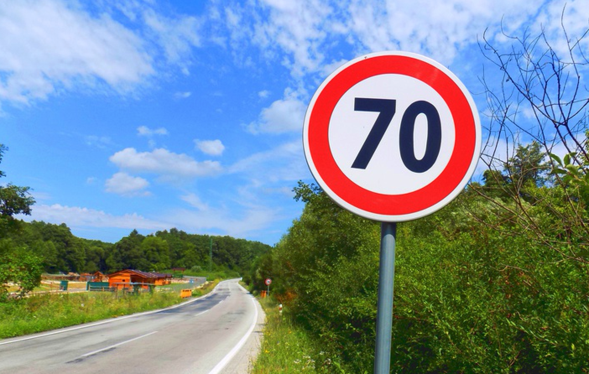

### **Introduction**

In this Project, we will implement a Traffic Sign Recognition Classifier using deep neural network and convolutional neural network to classify traffic signs. Each stage of the implementation will be described as a step by step solution. In addition to this write up, a complete Jupyter notebook can be found in the project folder.

### **The Dataset**

For this project we will use the  [German Traffic Sign Dataset](http://benchmark.ini.rub.de/?section=gtsrb&subsection=dataset). 

1. You can [Download the dataset] here (https://d17h27t6h515a5.cloudfront.net/topher/2016/November/581faac4_traffic-signs-data/traffic-signs-data.zip). This is a pickled dataset in which we've already resized the images to 32x32.
2. You can also Clone the project and start the notebook.

```
git clone https://github.com/udacity/CarND-Traffic-Signs
cd CarND-Traffic-Signs
jupyter notebook Traffic_Signs_Recognition.ipynb
```

### **Step 1 : Dataset Summary & Exploration **

The pickled data is a dictionary with 4 key/value pairs:

- `'features'` is a 4D array containing raw pixel data of the traffic sign images, (num examples, width, height, channels).
- `'labels'` is a 1D array containing the label/class id of the traffic sign. The file `signnames.csv` contains id -> name mappings for each id.
- `'sizes'` is a list containing tuples, (width, height) representing the original width and height the image.
- `'coords'` is a list containing tuples, (x1, y1, x2, y2) representing coordinates of a bounding box around the sign in the image. *THESE COORDINATES ASSUME THE ORIGINAL IMAGE. THE PICKLED DATA CONTAINS RESIZED VERSIONS (32 by 32) OF THESE IMAGES*

#### Basic summary

Number of training examples = 34799

Number of testing examples = 12630

Number of validation examples = 4410

Image data shape = (32, 32, 3)

Number of classes = 43

#### Exploratory visualization of the dataset

Here are some sample images from our dataset :

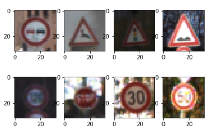

We have then 34799 image of size (32, 32, 3) that can be used to train a model and categorize traffic signs across 43 categories

Here is an example image for each of the different category to explore the category further :

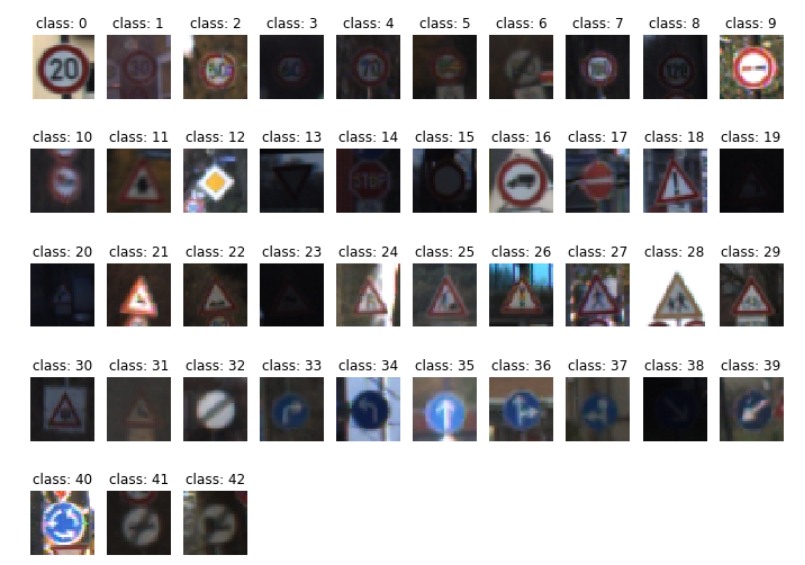

Lets see how our train data are spread across the different classes : 


*N.B : It sounds like the dataset is unbalances, some classes have low frequency (<250) We may want to get more sample for these low frequency classes to enhance the efficiency of our model , data augmentation sounds pretty well adapted here.* 

### **Step 2 : Dataset Summary & Exploration**

There are various aspects to consider when thinking about this problem:

- Neural network architecture (is the network over or underfitting?)
- Play around preprocessing techniques (normalization, rgb to grayscale, etc)
- Number of examples per label (some have more than others).
- Generate fake data.

Here is an example of a [published baseline model on this problem](http://yann.lecun.com/exdb/publis/pdf/sermanet-ijcnn-11.pdf). 

### Pre-processing the Data Set

Our pre-possessing pipeline will include Data cleaning , Data augmentation & Data normalization for this project

### Data cleaning

Some of the image like the one under are very dark and not so much useful for our model , lets delete them so as to improve our model performance

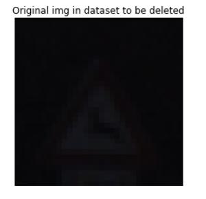

### Data Augmentation

In some condition Model performance can be bad if the number of data available is low. In this situation the model will quickly overfit the training set and result in bad accuracy on the validation set. In this part we will generate additional training image based on modification on our initial training set , this should help increasing our model accuracy by getting more data to train our model in general but it will also help for category where the training set contain only few images.  Data augmentation will be helpful for use as regularization technique. In order to augment our training set , we will use OpenCV to do few transformation :

*Image translation changes (allow a small random 2px move along x and y axis)

*Image Contrast/brightness changes (allow random brightness/contrast changes)

*Image scaling changes (allow  small random image scaling changes)

*Image rotation changes (allow small random rotation changes in the +-2 degres range)


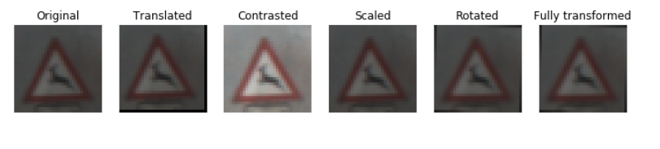

### Data Augmentation

Using this technique we will generate additional images for our training set so that each image category contain at least than 350 images. Here is the category spread of our training data after Image generation:

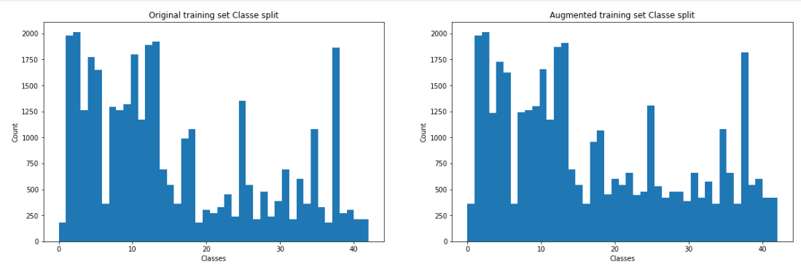


### Data Regularization

Now that we have clean data and enough data we will prepare it for our model , centering the data can help the model computation and discourages learning a more complex or flexible model, so as to avoid the risk of over-fitting.

Here is the mean value for our data before and after data regularization :

```
The mean value for our training data was : 83.051829 and is now : 0.000000
The mean value for our test data was : 82.148460 and is now : 0.000000
The mean value for our validation data was : 83.556427 and is now : 0.000000
```


### Shuffling our data

We are often presented with datasets that will be further split into training, testing & validation datasets. It is very important that the dataset is shuffled well to avoid any element of bias/patterns in the split datasets before training the ML model. Shuffling the data will help us improving our model quality and the predictive performance. 

### Model Architecture

As seen in the course LeNet-5 was a pioneering convolutional network designed by LeCun et al in 1998, for this project i tryed to implement more cutting edge architecture.

GoogleNet/Inception is the winner of the ILSVRC 2014 competition (a.k.a. Inception V1) from Google. It achieved a top-5 error rate of 6.67%! This was very close to human level performance.

The network used a CNN inspired by LeNet but implemented a novel element which is dubbed an inception module. It used batch normalization, image distortions and RMSprop. This module is based on several very small convolutions in order to drastically reduce the number of parameters. Their architecture consisted of a 22 layer deep CNN but reduced the number of parameters from 60 million (AlexNet) to 4 million.

##### GoogleLeNet Network architecture :

GoogleLeNet performance is mostly due to its inception module , which reduce the network parameter number , each inception module is as follow :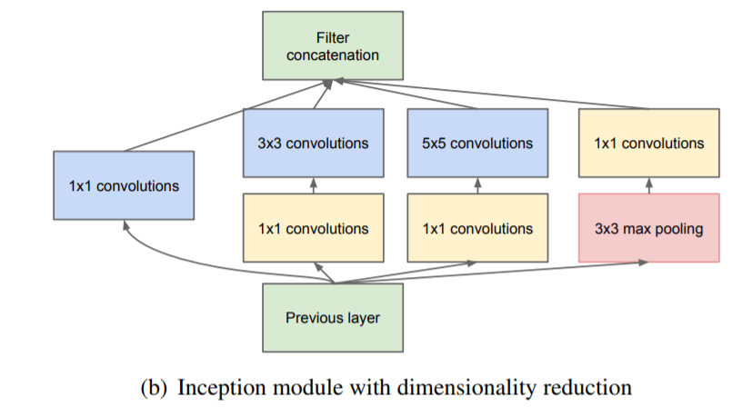

Model architecture :

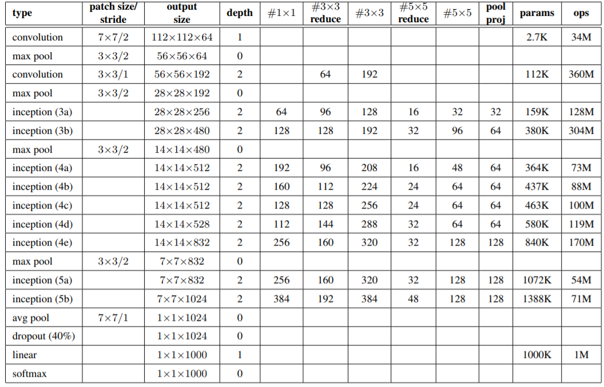

Since the model require high computation power , we will go for a lightweight implementation of the model but based on the same core principle , additionally the model will be updated for taking images input of shape 32*32 *3 and a 43 output corresponding to our 43 different traffic signs classes. Our model will be as follow :

| Layer           | Input    | Output   |
| --------------- | -------- | -------- |
| Convolution     | 32x32x3  | 28x28x6  |
| Max pooling     | 28x28x6  | 14x14x6  |
| Convolution     | 14x14x6  | 10x10x16 |
| Max pooling     | 10x10x16 | 5x5x16   |
| Flatten         | 5x5x16   | 400      |
| Fully connected | 400      | 120      |
| Fully connected | 120      | 80       |
| Fully connected | 80       | 43       |

Ref :<https://medium.com/@siddharthdas_32104/cnns-architectures-lenet-alexnet-vgg-googlenet-resnet-and-more-666091488df5>

Ref :<https://www.cs.unc.edu/~wliu/papers/GoogLeNet.pdf>

Thankyou for liferlisiqi help that help me shape the network architecture

Inception Module help us reducing the model number of parameters and are the core invention for this model , further information can also be found here : https://hacktilldawn.com/2016/09/25/inception-modules-explained-and-implemented/


### Train, Validate and Test the Model

A validation set can be used to assess how well the model is performing. A low accuracy on the training and validation sets imply underfitting. A high accuracy on the training set but low accuracy on the validation set implies overfitting.

##### Model Hyperparameters

```
LEARNING_RATE = 4e-4
EPOCHS = 7
BATCH_SIZE = 128
```

##### Model definition ( architecture , loss function , optimizer)

  Here is our model architecture definition 
    def Inception(inputs, conv11_size, conv33_11_size, conv33_size,conv55_11_size, conv55_size, pool11_size):
        conv11 = layers.conv2d(inputs, conv11_size, [1, 1])
        conv33_reduce = layers.conv2d(inputs, conv33_11_size, [1, 1])
        conv33 = layers.conv2d(conv33_reduce, conv33_size, [3, 3])
        conv55_reduce = layers.conv2d(inputs, conv55_11_size, [1, 1])
        conv55 = layers.conv2d(conv55_reduce, conv55_size, [5, 5])
        pool_proj = layers.max_pool2d(inputs, [3, 3], stride = 1, padding='SAME')
        pool11 = layers.conv2d(pool_proj, pool11_size, [1, 1])
        return tf.concat([conv11, conv33, conv55, pool11], 3)
    
    def GoogLeNet(inputs, dropout_keep_prob):
    conv1 = layers.conv2d(inputs, 64, [3, 3], stride = 2)     
    inception_2a = Inception(conv1, 64, 96, 128, 16, 32, 32) 
    inception_2b = Inception(inception_2a, 128, 128, 192, 32, 96, 64)
    pool2 = layers.max_pool2d(inception_2b, [3, 3]) 
    
    inception_3a = Inception(pool2, 192, 96, 208, 16, 48, 64)
    inception_3b = Inception(inception_3a, 160, 112, 224, 24, 64, 64) 
    pool3 = layers.max_pool2d(inception_3b, [3, 3]) # 3x3x512
    
    inception_4a = Inception(pool3, 256, 160, 320, 32, 128, 128)
    inception_4b = Inception(inception_4a, 384, 192, 384, 48, 128, 128)
    pool4 = layers.avg_pool2d(inception_4b, [3, 3], stride = 1) 
    
    reshape = tf.reshape(pool4, [-1, 1024])
    dropout = layers.dropout(reshape, dropout_keep_prob)
    logits = layers.fully_connected(dropout, 43, activation_fn=None)
    
    return logits
Lets apply our model and define our Cross entropy calculation and similarly our loss function that will be minimized. Additional we will use Adam Optimizer  ,an extension to stochastic gradient descent that has recently seen broader adoption for deep learning applications in computer vision.

```
# Apply our model 
logits = GoogLeNet(x, keep_prob)

#Define our Cross entropy and our loss function that will be minimized
cross_entropy = tf.nn.softmax_cross_entropy_with_logits(labels=one_hot_y, logits=logits)
loss = tf.reduce_mean(cross_entropy)

#Select the Tf optimizer for our model , we will choose AdamOptimizer
optimizer = tf.train.AdamOptimizer(learning_rate = LEARNING_RATE)
train_optimizer = optimizer.minimize(loss)
```

The authors describe Adam as combining the advantages of two other extensions of stochastic gradient descent. Specifically:

- **Adaptive Gradient Algorithm** (AdaGrad) that maintains a per-parameter learning rate that improves performance on problems with sparse gradients (e.g. natural language and computer vision problems).
- **Root Mean Square Propagation** (RMSProp) that also maintains per-parameter learning rates that are adapted based on the average of recent magnitudes of the gradients for the weight (e.g. how quickly it is changing). This means the algorithm does well on online and non-stationary problems (e.g. noisy). 


##### Model accuracy calculation 

Lets define a function that will help us     
    #Define a function to calculate the accuracy of our model
    exact_answer = tf.equal(tf.argmax(logits, 1), tf.argmax(one_hot_y, 1))
    accuracy_operation = tf.reduce_mean(tf.cast(exact_answer, tf.float32))
    
    def get_accuracy(X, Y):
        
        #get session
        sess = tf.get_default_session()
        
        #initialize our variable
        number_of_data = len(X)
        global_accuracy = 0
     
        for offset in range(0, number_of_data, BATCH_SIZE):
            batch_X, batch_Y = X[offset:offset + BATCH_SIZE], Y[offset:offset + BATCH_SIZE]
            accuracy = sess.run(accuracy_operation, feed_dict={x: batch_X, y: batch_Y})
            global_accuracy += (accuracy * len(batch_X))
            output = global_accuracy / number_of_data
            
        return output#get session
    sess = tf.get_default_session()
    
    #initialize our variable
    number_of_data = len(X)
    global_accuracy = 0
     
    for offset in range(0, number_of_data, BATCH_SIZE):
        batch_X, batch_Y = X[offset:offset + BATCH_SIZE], Y[offset:offset + BATCH_SIZE]
        accuracy = sess.run(accuracy_operation, feed_dict={x: batch_X, y: batch_Y})
        global_accuracy += (accuracy * len(batch_X))
        output = global_accuracy / number_of_data
        
    return output
Time to train our model !

```
Training...
EPOCH : 1
Training Accuracy : 0.202 , Valid Accuracy : 0.395
EPOCH : 2
Training Accuracy : 0.711 , Valid Accuracy : 0.877
EPOCH : 3
Training Accuracy : 0.960 , Valid Accuracy : 0.930
EPOCH : 4
Training Accuracy : 0.984 , Valid Accuracy : 0.959
EPOCH : 5
Training Accuracy : 0.988 , Valid Accuracy : 0.947
EPOCH : 6
Training Accuracy : 0.990 , Valid Accuracy : 0.929
EPOCH : 7
Training Accuracy : 0.992 , Valid Accuracy : 0.960
```

##### Model final accuracy : 96.0%  !

##### *( as future work I think this can be improved with more epochs for those that have more powerful workstation)*

##### Summary of our model

The following parameters have been used to train the model :

- Type of optimizer: AdamOptimizer
- Batch size: 128
- Training Epochs: 7
- Learning rate: 4e-4
- Loss function to minimize : cross-entropy formula
- Dropout : 50% (as a regularization technique)

### Accuracy analysis

Below are the train and Validation accuracy value as the model get trained

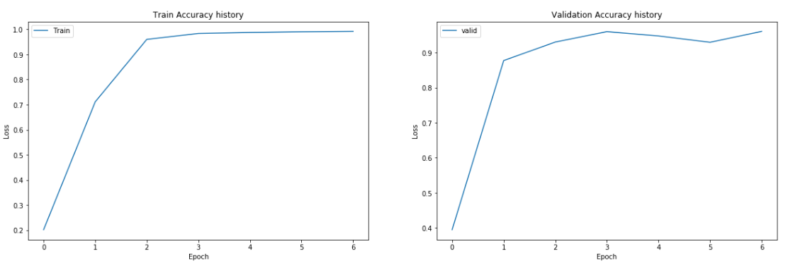

The model did well as he fit the training set with a 99.2% without over fitting !

The accuracy on the validation set seems to converge a little less faster but achieve 96.0% in 7 epochs which is not bad. I think training the model on more epoch can help achieve higher performance if you don't have computational restriction. 


## Step 3: Test a Model on New Images

To give ourself more insight into how our model is working, lets download at least five pictures  from the web and use your model to predict the traffic sign type.

Here are the five pictures we will take from a quick Google image search :

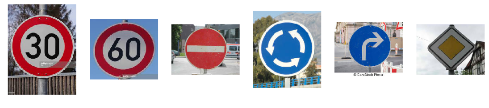

In order to make a prediction on these images we will apply the same image processing pipeline that we've used to build our model , we will reshape the data to 32* 32* 3 image shape , regularize the image and then use our trained model to make a prediction.

Here are the images after pre processing *(and before normalization)* :

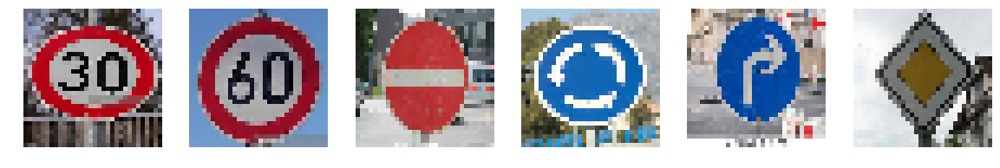

Time to make a prediction  !


### Load our trained model and make a prediction !

```
saver = tf.train.import_meta_graph('./tensorflow_model/GoogleLeNet.ckpt.meta')
```

```
INFO:tensorflow:Restoring parameters from ./tensorflow_model/GoogleLeNet.ckpt
Real Classe for images      : [1, 3, 17, 40, 33, 12]
Predicted Classe for images : [ 1  3 17 40 33 12]
Accuracy = 1.000
```

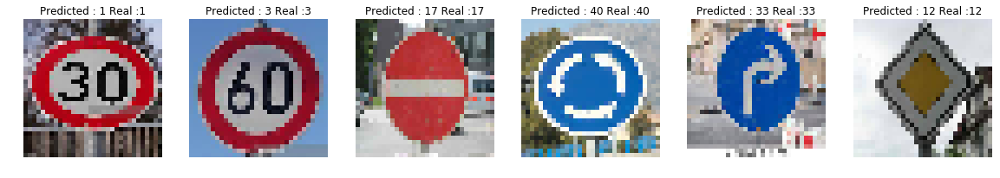

### Awesome our model predicted with a 100% accuracy on this image set !

As we got 96.0 % on our validation set , we can say that the model will fail predict the proper category for some other images. nonetheless this validate pretty well the performances obtained on the validation set

Lets dig a deep deeper in our model prediction and lets Output the Top 5 Softmax Probabilities For Each Image Found on the Web


it also sounds like all the prediction were straightforward for the model expect for image 2 where the model predict a low probability for the 60 kmh speed limit to be a class 29 panel, strange as these different panel have different shapes.