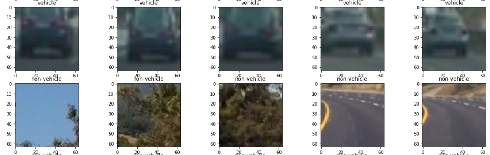
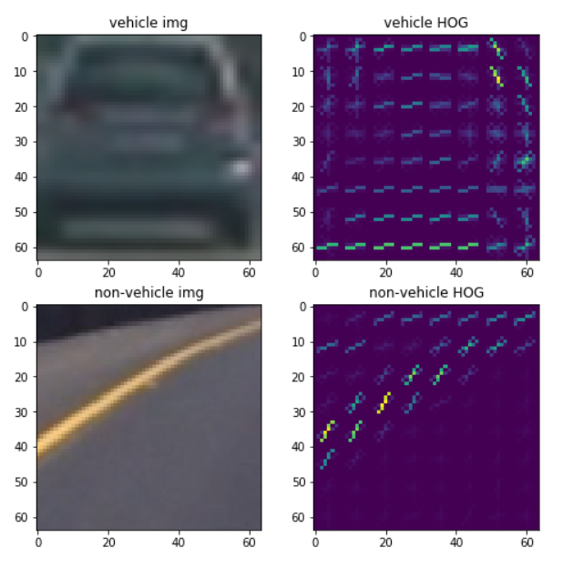
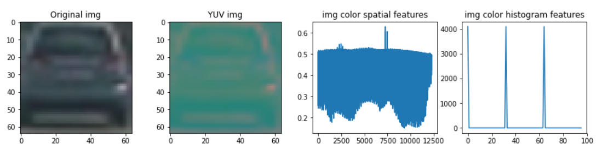
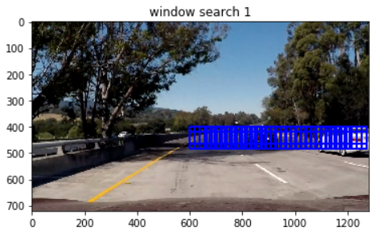
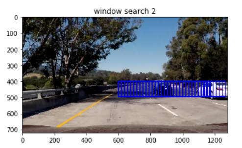
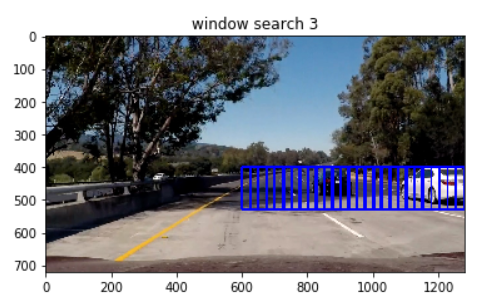
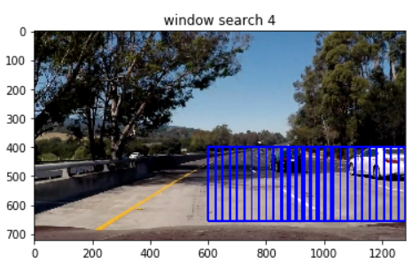
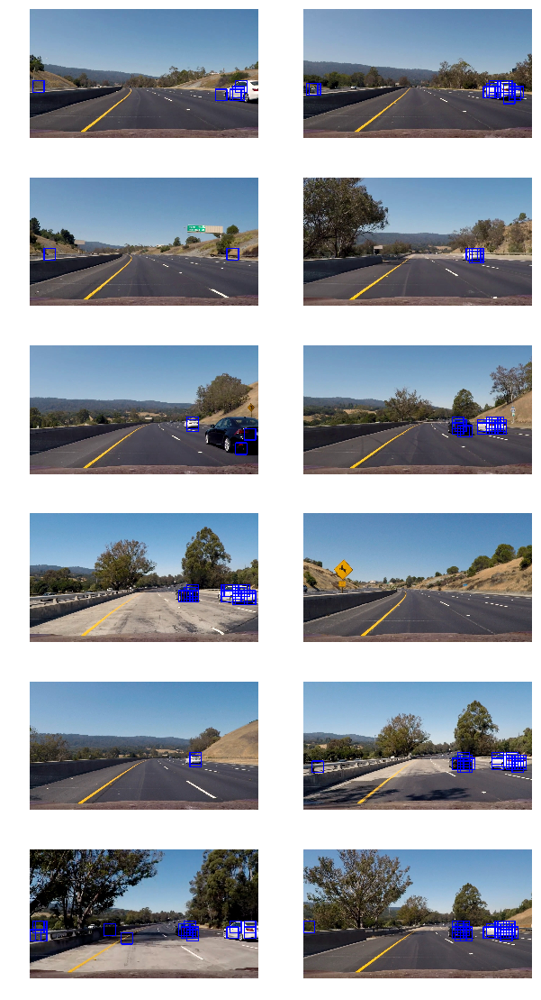
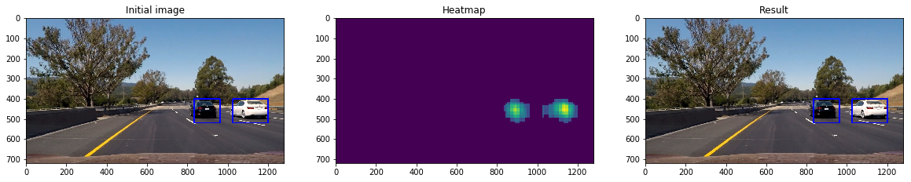

## Vehicle detection Project

In the pas project we have been using exclusively Computer vision to detect Road Lane an to extract some information from it such as curvature and so on , in this project we will continue with our computer vision approach so we can detect object , more specifically vehicle. 

Although recent technique based on Convolutional Neural network can run real time and achieve similar/better performance , it is important to understand the criteria that make the model works, Understanding Computer vision is a key for tuning CNNs for image processing.

---

**Goal for the project :**

In this project,we will write a software pipeline to detect vehicles in a video,the goals / steps of this project are the following:

1. Perform a Histogram of Oriented Gradients (HOG) feature extraction on a labeled training set of images and train a classifier Linear SVM classifier
2. Optionally,  apply a color transform and append binned color features, as well as histograms of color, to our HOG feature vector.
3. Build a Feature extraction pipeline
4. Prepare our Train and test set
5. Train our model Note: for those first two steps don't forget to normalize your features and randomize a selection for training and testing.
6. Implement a sliding-window technique and use your trained classifier to search for vehicles in images.
7. Run your pipeline on a video stream (start with the test_video.mp4 and later implement on full project_video.mp4) and create a heat map of recurring detections frame by frame to reject outliers and follow detected vehicles.
8. Estimate a bounding box for vehicles detected.


# 1. The Dataset

In order for us to detect vehicle we will train a model , for us to achieve this we will use a collection of Car and non Car picture provided by Udacity. Each element are of size **(64,64,3)** and the training set is well balance so that we have **8792 vehicle images** and **8968  non-vehicle images**.  Here are links to the labeled data for [vehicle](https://s3.amazonaws.com/udacity-sdc/Vehicle_Tracking/vehicles.zip) and [non-vehicle](https://s3.amazonaws.com/udacity-sdc/Vehicle_Tracking/non-vehicles.zip) from Udacity.

After downloading the dataset here are few example of Vehicle and non vehicle images :




Since all image shape are the same and that the dataset is well balanced , we will keep the data as is to train our model.

## 2. Extracting Features 

###  HOG Feature extraction

By computing gradient magnitude and directions at each pixels , and grouping them into small cells we can compute a histogram of gradient orientation of each cell and extract a signature for a given shape. In our case vehicle shapes.Let's use the function from Udacity class as bellow.

The number of orientations is specified as an integer, and represents the number of orientation bins that the gradient information will be split up into in the histogram. Typical values are between 6 and 12 bins.

The pixels_per_cell parameter specifies the cell size over which each gradient histogram is computed. This parameter is passed as a 2-tuple so you could have different cell sizes in x and y, but cells are commonly chosen to be square.

The cells_per_block parameter is also passed as a 2-tuple, and specifies the local area over which the histogram counts in a given cell will be normalized. Block normalization is not necessarily required, but generally leads to a more robust feature set.

```python
def get_hog_features(img, orient, pix_per_cell, cell_per_block, vis=True,            feature_vec=True):
    """
    Function accepts params and returns HOG features (optionally flattened) and an optional matrix for 
    visualization. Features will always be the first return (flattened if feature_vector= True).
    A visualization matrix will be the second return if visualize = True.
    """

    return_list = hog(img, orientations=orient, pixels_per_cell=(pix_per_cell, pix_per_cell),
                                  cells_per_block=(cell_per_block, cell_per_block), transform_sqrt=False, visualise= vis, feature_vector= feature_vec)

    # name returns explicitly
    hog_features = return_list[0]
    if vis:
        hog_image = return_list[1]
        return hog_features, hog_image
    else:
        return hog_features
```
We can see the result of our HOG Feature extraction as bellow :



### Color Extraction 

As seen Gradient can help us extract a signature for a given shape, not only gradient but the image color can also help detect an object/vehicle especially as car colors tends to be saturated on a vehicle , for this reason we will use the YUV colorspace to extract color feature for our image. As seen below :




### Feature Extraction pipeline

Now that we have been extracting shape based features (HOG) and color based features it is time to build a pipeline so we can combine these feature and extract it for our entire dataset. As our color based Feature and our shape based feature can have a difference in magnitude , we will normalize our data to make sure that one feature doesn't dominate another one. After few testing it has been show than adding color Feature doesn't increase much the accuracy for our model but impact a lot the processing efficiency , we will then build a pipeline to only extract the HOG Features.

```python
# Define a function to extract features from a list of images
# Have this function call bin_spatial() and color_hist()
def extract_features(imgs, cspace='YUV', spatial_size=(32, 32),
                        hist_bins=32, hist_range=(0, 256)):
    # Create a list to append feature vectors to
    features = []
    # Iterate through the list of images
    for file in imgs:
        # Read in each one by one
        image = mpimg.imread(file.replace('\\','/'))
        # apply color conversion if other than 'RGB'
        if cspace != 'RGB':
            if cspace == 'HSV':
                feature_image = cv2.cvtColor(image, cv2.COLOR_RGB2HSV)
            elif cspace == 'LUV':
                feature_image = cv2.cvtColor(image, cv2.COLOR_RGB2LUV)
            elif cspace == 'HLS':
                feature_image = cv2.cvtColor(image, cv2.COLOR_RGB2HLS)
            elif cspace == 'YUV':
                feature_image = cv2.cvtColor(image, cv2.COLOR_RGB2YUV)
        else: feature_image = np.copy(image) 
            
        # Apply bin_spatial() to get spatial color features
        #spatial_features = bin_spatial(feature_image, size=spatial_size)
        # Apply color_hist() also with a color space option now
        #hist_features = color_hist(feature_image, nbins=hist_bins, bins_range=hist_range)
        #lets concatenate our spatial color features and our hist_features
        #color_feature = np.concatenate((spatial_features, hist_features))  

        #lets now get the HOG features we will use the HOG feture from all the channel to improve the model performance
        hog_feature1 ,_ = get_hog_features(feature_image[:,:,0], 9, 8, 2, vis=True, feature_vec=True)
        hog_feature2 ,_ = get_hog_features(feature_image[:,:,1], 9, 8, 2, vis=True, feature_vec=True)
        hog_feature3 ,_ = get_hog_features(feature_image[:,:,2], 9, 8, 2, vis=True, feature_vec=True)
        hog_feature = np.concatenate((hog_feature1,hog_feature2,hog_feature3))
                
        #concatenate our color and shape feature
        #concatenated_features = np.concatenate((color_feature,hog_feature))
        #Append the new feature vector to the features list
        features.append(hog_feature)
    
    # Return list of feature vectors
    return features
```

## 3. Training our model 

As we have been extracting our features  , we will now train our model.

### Prepare our training set

Now that we have extracted our feature , lets prepare our training set by shuffling and normalizing the car and non car features and also create the associate label vector. 

```python
#Stack our data
x_data = np.vstack((car_features, non_car_features)).astype(np.float64)

# Fit a per-column scaler
X_scaler = StandardScaler().fit(x_data)

# Apply the scaler to X
scaled_X = X_scaler.transform(x_data)

#create our labels (1 = cars , 0 = non-cars)
y_data = np.hstack((np.ones(len(car_features)), np.zeros(len(non_car_features))))

#shuffle our data
scaled_X , y_data = shuffle(scaled_X,y_data)

#create a training (80%) set and a test set (20%)
X_train, X_test, y_train, y_test = train_test_split(
    scaled_X, y_data, test_size=0.2, random_state=1)
```

### Training our Model

We will use a linear SVC as follow :

```python
%%time
# Use a linear SVC 
svc = LinearSVC()
#train the model 
svc.fit(X_train, y_train)
# Check the score of the SVC
print('Test Accuracy of our SVC = ', round(svc.score(X_test, y_test), 3))
```

Since adding color hasn't changed a lot the accuracy we have extracted only the HOG features , the accuracy of our linear SCV with HOG feature only as input is of **98,2%** for a training time of **27.9 seconds**.

Here are few prediction for our model on few samples :

*Model prediction for our 10 selected samples : [1. 0. 1. 1. 1. 0. 1. 1. 1. 1. 1. 0. 0. 0. 1. 0. 0. 0. 1. 0.]*
*Real labels for our 10 selected samples      : [1. 0. 1. 1. 1. 0. 1. 1. 1. 0. 1. 0. 0. 0. 1. 0. 1. 0. 1. 0.]*

Our model seems to work pretty fine ! Lets now build a sliding windows algorithm to detect cars positions in an image. 

## 4. Sliding windows search

Since our model as been trained , it is time to build a pipeline , so we can search for a car position in an image , for this we will implement a sliding windows search function as  bellow

```python
"""modifyed function from Course : Define a function that takes an image,start and stop positions in both x and y,window size (x and y dimensions),and overlap fraction (for both x and y)""""

def slide_window(y_start_stop=[360, 700], xy_window=(64, 64), xy_overlap=(0.5, 0.5)):

    # Initialize a list to append window positions to
    window_list = []

    x_start_stop =[600, 1280] #let not focus on the opposite road

    # Compute the span of the region to be searched    
    xspan = x_start_stop[1] - x_start_stop[0]
    yspan = y_start_stop[1] - y_start_stop[0]
    # Compute the number of pixels per step in x/y
    nx_pix_per_step = np.int(xy_window[0]*(1 - xy_overlap[0]))
    ny_pix_per_step = np.int(xy_window[1]*(1 - xy_overlap[1]))
    # Compute the number of windows in x/y
    nx_buffer = np.int(xy_window[0]*(xy_overlap[0]))
    ny_buffer = np.int(xy_window[1]*(xy_overlap[1]))
    nx_windows = np.int((xspan-nx_buffer)/nx_pix_per_step) 
    ny_windows = np.int((yspan-ny_buffer)/ny_pix_per_step) 

    # Loop through finding x and y window positions
    # Note: you could vectorize this step, but in practice
    # you'll be considering windows one by one with your
    # classifier, so looping makes sense
    for ys in range(ny_windows):
        for xs in range(nx_windows):
            # Calculate window position
            startx = xs*nx_pix_per_step + x_start_stop[0]
            endx = startx + xy_window[0]
            starty = ys*ny_pix_per_step + y_start_stop[0]
            endy = starty + xy_window[1]
            # Append window position to list
            window_list.append(((startx, starty), (endx, endy)))
    # Return the list of windows
    return window_list
```
As windows search  in an (760,1280,3) image is an expensive process , we have decided to deal only with the half right part for our image by defining  ` x_start_stop =[600, 1280]` we will also focus on the road section (excluding sky and so on) by defining  ` y_start_stop=[360, 700]`

Refining the window shape by search region help us reduce the number of window in this case we know that we look for car and that they will look big when close and will look smaller and smaller as it it further away. Hopefully this optimize the windows search as this is a pretty expensive search. Here are few attempt we did :

```python
windows1= slide_window(y_start_stop=(400,500),xy_window=(64,64),xy_overlap=(0.7,0.7))
```



```python
windows2= slide_window(y_start_stop=(400,500),xy_window=(96,96),xy_overlap=(0.8,0.8))
```




```python
windows3= slide_window(y_start_stop=(400,550),xy_window=(128,128),xy_overlap=(0.8,0.8))
```



```python
windows4= slide_window(y_start_stop=(400,656),xy_window=(256,256),xy_overlap=(0.9,0.9))
```



Although we try to best optimize the Sliding windows search , it is still a slow process as for each windows we extract the HOG feature and predict if a car is detected or not. 

### HOG Subsampling

In order to further optimize our search function we will use HOG sub sampling so that HOG Feature can be extracted only once for the full image and reuse the value for each sub part of the image to be evaluate.

```python
#modifyed fucntion from course : Define a function that will search cars in a list of windows

def search_windows(img, svc,scale, color_space='YUV', y_start_stop=(400,500),

                    spatial_size=(32, 32), hist_bins=32, 

                    hist_range=(0, 256), orient=9, 

                    pix_per_cell=8, cell_per_block=2):

img = img.astype(np.float32)/255
img = img[y_start_stop[0]:y_start_stop[1],:,:]

#Create an empty list to receive positive detection windows
on_windows = []

# apply color conversion if other than 'RGB'
if color_space != 'RGB':
    if color_space == 'HSV':
        img = cv2.cvtColor(img, cv2.COLOR_RGB2HSV)
    elif color_space == 'LUV':
        img = cv2.cvtColor(img, cv2.COLOR_RGB2LUV)
    elif color_space == 'HLS':
        img = cv2.cvtColor(img, cv2.COLOR_RGB2HLS)
    elif color_space == 'YUV':
        img = cv2.cvtColor(img, cv2.COLOR_RGB2YUV)
    elif color_space == 'YCrCb':
        img = cv2.cvtColor(img, cv2.COLOR_RGB2YCrCb)
else: hog_feature = np.copy(img) 
    
    # rescale image if other than 1.0 scale
if scale != 1:
    imshape = img.shape
    img = cv2.resize(img, (np.int(imshape[1]/scale), np.int(imshape[0]/scale)))

# Define blocks and steps as above
nxblocks = (img[:,:,0].shape[1] // pix_per_cell)+1  #-1
nyblocks = (img[:,:,0].shape[0] // pix_per_cell)+1  #-1 
nfeat_per_block = orient*cell_per_block**2
# 64 is the orginal sampling rate, with 8 cells and 8 pix per cell
window = 64
nblocks_per_window = (window // pix_per_cell)-1 
cells_per_step = 2  # Instead of overlap, define how many cells to step
nxsteps = (nxblocks - nblocks_per_window) // cells_per_step
nysteps = (nyblocks - nblocks_per_window) // cells_per_step    

#lets now get the HOG features we will use the HOG feture from all the channel to improve the model performance
hog_feature1 ,_ = get_hog_features(img[:,:,0], orient, pix_per_cell, cell_per_block, vis=True, feature_vec=False)
hog_feature2 ,_ = get_hog_features(img[:,:,1], orient, pix_per_cell, cell_per_block, vis=True, feature_vec=False)
hog_feature3 ,_ = get_hog_features(img[:,:,2], orient, pix_per_cell, cell_per_block, vis=True, feature_vec=False)

for xb in range(nxsteps):
    for yb in range(nysteps):
        ypos = yb*cells_per_step
        xpos = xb*cells_per_step

        # Extract HOG Feature for this step
        hog_feat1 = hog_feature1[ypos:ypos+nblocks_per_window, xpos:xpos+nblocks_per_window].ravel()
        hog_feat2 = hog_feature2[ypos:ypos+nblocks_per_window, xpos:xpos+nblocks_per_window].ravel() 
        hog_feat3 = hog_feature3[ypos:ypos+nblocks_per_window, xpos:xpos+nblocks_per_window].ravel() 
        hog_features = np.hstack((hog_feat1, hog_feat2, hog_feat3))
        
        #normalize the HOG feature
        #hog_features = (hog_features - hog_features.mean()) / (np.max(hog_features) - np.min(hog_features))
        
        xleft = xpos*pix_per_cell
        ytop = ypos*pix_per_cell
        
        test_prediction = svc.predict(hog_features.reshape(1, -1))
        
        if test_prediction == 1:
            xbox_left = np.int(xleft*scale)
            ytop_draw = np.int(ytop*scale)
            win_draw = np.int(window*scale)
            
            on_windows.append(((xbox_left, ytop_draw+y_start_stop[0]),(xbox_left+win_draw,ytop_draw+win_draw+y_start_stop[0])))

return on_windows
```
Alright it is time to test it on some images 



We can se that we can now detect cars , but we are facing 2 problems , we have a false positives , and a lot of detection box for the same car.

In order to solve the false detection we will refine the window scale with regards to the search area, we will also use some heatmap technique to detect car once. later on , detection could also be smooth using multiple frames , if we detect a car only in one frame and no longer after then this could probably be a False positive.

## 5. Heat Map 

Creating heat map for our vehicle detection will help us to detect them only once using the different detection boxes that have detected the same vehicle and applying a threshold to it. 

```python
from scipy.ndimage.measurements import label

#modified functions from udacity courses 

#define a function that will create a heatmap from our vehicle detection box
def add_heat(heatmap, bbox_list):
    # Iterate through list of bboxes
    for box in bbox_list:
        # Add += 1 for all pixels inside each bbox
        # Assuming each "box" takes the form ((x1, y1), (x2, y2))
        heatmap[box[0][1]:box[1][1], box[0][0]:box[1][0]] += 1
    # Return updated heatmap
    return heatmap# Iterate through list of bboxes


#define a function that apply a threshold to our heatmap (to decrease false detection) and to label the remainding regions
def apply_threshold(heatmap, threshold):
    # Zero out pixels below the threshold
    heatmap[heatmap <= threshold] = 0
    # Label regions
    labels = label(heatmap)
    # Return thresholded map
    return labels

#define a function that will draw a single box based on our detected regions
def draw_labeled_bboxes(img, labels):
    box = []
    for car_number in range(1, labels[1]+1):
        # Find pixels with each car_number label value
        nonzero = (labels[0] == car_number).nonzero()
        # Identify x and y values of those pixels
        nonzeroy = np.array(nonzero[0])
        nonzerox = np.array(nonzero[1])
        # Define a bounding box based on min/max x and y
        bbox = ((np.min(nonzerox), np.min(nonzeroy)), (np.max(nonzerox), np.max(nonzeroy)))
        box.append(bbox)
        # Draw the box on the image
        cv2.rectangle(img, bbox[0], bbox[1], (0,0,255), 6)
    # Return the image and final rectangles
    return img, box
```

Here is the result for our heat map processing :



We have now only one detection box per car detected and it sound like 3 is a good threshold , lets update our pipeline and test it! 

*N.B After testing, we will use different scaling in order to get more efficiency at detecting the vehicle in de favor to the processing efficiency. this is implemented in the final pipeline bellow* 


## Final Pipeline 

Although slow , the pipeline works as expected , however , sometime they are still more than one detection for one vehicle , this is due to our algorithm detecting distinct part of the car as car being to far from each other to be merge in our heat map process. In order to handle this lets create a class that can easily help us handling these situation. 

```python
#create a Vehicle detection object inspired from Jeremy shannon work

class vehicle_detection():

    def init(self):
        # initialize with an empty list to log the detected box
        self.box_history = [] 

def process_frame(self, box):
    #append the box we want to draw to our history
    self.box_history.append(box)
    
    #if we have processed more than 15 frame use the history from the last 15 frame to create our heatmap
    if len(self.box_history) > 15:
        # only keep the last 15 detection
        self.box_history = self.box_history[len(self.box_history)-15:]
```
Here is our final pipeline :    

```python
vehicle_detector = vehicle_detection()

def find_car(img):

windows = []

#return windows where we predict a car was in it
car_windows = search_windows(img,svc,scale=1, color_space='YUV', y_start_stop=(400,650),
                spatial_size=(32, 32), hist_bins=32, 
                hist_range=(0, 256), orient=9, 
                pix_per_cell=8, cell_per_block=2)

windows.extend(car_windows)

car_windows = search_windows(img,svc,scale=1.5, color_space='YUV', y_start_stop=(400,650),
                spatial_size=(32, 32), hist_bins=32, 
                hist_range=(0, 256), orient=9, 
                pix_per_cell=8, cell_per_block=2)

windows.extend(car_windows)

if len(windows) > 0:
    vehicle_detector.process_frame(windows)

#create an empty heatmap
heatmap = np.zeros_like(img[:,:,0])

for box in vehicle_detector.box_history:
        #add heat 
        heatmap = add_heat(heatmap, box)
#apply a threshold and return labels
labels = apply_threshold(heatmap, 20)

#draw a single box based on our detected regions
result_img, box =draw_labeled_bboxes(img,labels)

return result_img
```
Time to try it on our video !

## Video Implementation

```python
video = VideoFileClip("test_video.mp4")
project_clip = video.fl_image(find_car)
video_output = "output_subclip.mp4"
%time project_clip.write_videofile(video_output, audio=False,threads=4,progress_bar = True)

```

Here's a [link to my video result](https://youtu.be/GByqxd0R35k) ! 


---

### Discussion

Although traditional computer vision technic car work identifying car on a video the current implementation will be challenged if it has to run real time . 

Some possible improvement could be not to run a sliding windows search every frame but only each x frame , we could also track the detect vehicle to predict their position on the next frame so we can restrict the sliding windows to specific area , we can similarly predict where a car is likely to appear on the road as well. Heatmap thresholds could also be dynamically update with regards to the number of car detected , their position and so on. 

It has been really interesting to see how we can extract feature from an image to detect complex object like a vehicle , this understanding will definitely assist fine tuning an implementation with convolutional neural network on which I am sure we could achieve real time and reduce false positives. It would be interesting to implement a pipeline using a pretrained YOLO V3 for instance.


