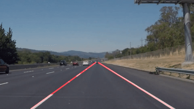
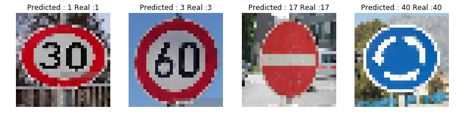
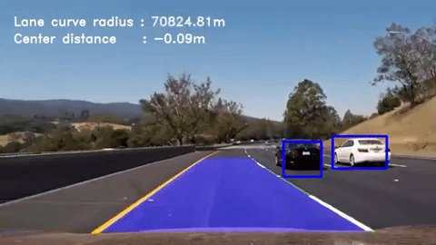
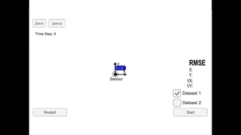
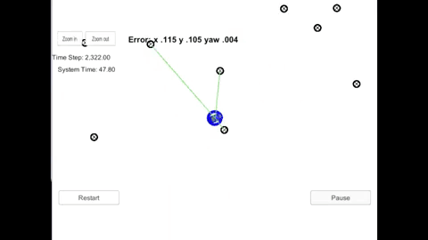

# Self-driving-car-nanodegree
This is my home folder for the Udacity Self Driving Car Engineer Nanodegree check out my projects bellow !

| [Basic Lane Line Detection](https://github.com/Quentin-w/self-driving-car-nanodegree/tree/master/CarND-LaneLines-P1) | [Traffic sign classifier](https://github.com/Quentin-w/self-driving-car-nanodegree/tree/master/CarND-Traffic-Sign-Classifier-Project-P2) | [Behavioral Cloning](https://github.com/Quentin-w/self-driving-car-nanodegree/tree/master/CarND-Behavioral-Cloning-P3) |
| ------------------------------------------------------------ | ------------------------------------------------------------ | ------------------------------------------------------------ |
|  |  |  |
| [**Advanced Lane Detection**](https://github.com/Quentin-w/self-driving-car-nanodegree/tree/master/CarND-LaneLines-P1) | [**Object detection**](https://github.com/Quentin-w/self-driving-car-nanodegree/tree/master/CarND-Vehicle-Detection-P5) | [**(Sensor Fusion) Extended Kalman Filter**](https://github.com/Quentin-w/self-driving-car-nanodegree/tree/master/CarND-Extended-Kalman-Filter-Project-P6) |
|  |  |  |
| [**(Sensor Fusion) Unscented Kalman Filter**](https://github.com/Quentin-w/self-driving-car-nanodegree/tree/master/CarND-Unscented-Kalman-Filter-Project-P7) | [**Particle Filter - Kidnapped Vehicle**](https://github.com/Quentin-w/self-driving-car-nanodegree/tree/master/CarND-Kidnapped-Vehicle-Project-P8) | [**PID Control project**](https://github.com/Quentin-w/self-driving-car-nanodegree/tree/master/CarND-PID-Control-Project-P9) |
|  |  | Video to be added                                            |
| [**Model Predictive control**](https://github.com/Quentin-w/self-driving-car-nanodegree/tree/master/CarND-MPC-Project-P10) |                                                              |                                                              |
|  |                                                              |                                                              |

